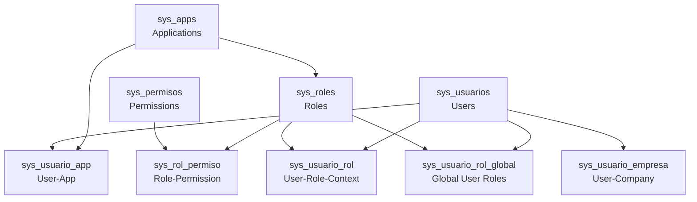

NewKipital implements a sophisticated **Role-Based Access Control (RBAC)** system with support for multi-app, multi-company environments. The system allows fine-grained control over user permissions through roles, permission overrides, and company-specific contexts.

## Core Concepts

### Multi-App Architecture

The platform supports multiple applications:

- **kpital** - Main payroll and HR application
- **timewise** - Time tracking and attendance application

Roles can be:
- **Global (Master)** - Available across all applications (`idApp = NULL`)
- **App-specific** - Restricted to a single application

### Multi-Company Support

Users can have different roles in different companies:

<CodeGroup>
```text Example: Cross-Company Roles
User: John Doe
├─ Company A (kpital)
│  └─ Role: ADMIN
├─ Company B (timewise)
│  └─ Role: EMPLOYEE
└─ Company C (kpital)
   └─ Role: ACCOUNTANT
```
</CodeGroup>

### Permission Model

Permissions are atomic actions that define what users can do:

<Card title="Permission Format" icon="key">
  Permissions follow the pattern: `module:action[:subaction]`
  
  Examples:
  - `config:roles` - Manage roles
  - `config:permissions` - Manage permissions
  - `payroll:approve` - Approve payroll
  - `employees:list` - View employee list
</Card>

## System Architecture

### Data Model

The access control system consists of several interconnected tables:



### Permission Resolution Order

When checking if a user has a permission, the system evaluates in this order:

<Steps>
  <Step title="Global Denials">
    Check `sys_usuario_permiso_global` - if permission is denied globally, **DENY wins**
  </Step>
  
  <Step title="Context Overrides">
    Check `sys_usuario_permiso` for the specific company + app context:
    - If effect is `DENY`, reject access
    - If effect is `ALLOW`, grant access
  </Step>
  
  <Step title="Global Roles">
    Check `sys_usuario_rol_global` - roles that apply to ALL companies
    
    Then check for `sys_usuario_rol_exclusion` - exclude global role from specific company
  </Step>
  
  <Step title="Context Roles">
    Check `sys_usuario_rol` - roles assigned for specific company + app
  </Step>
</Steps>

<Warning>
  **DENY always wins over ALLOW** in permission resolution. This ensures secure defaults.
</Warning>

## Key Features

### 1. Context-Based Roles

Users can have different roles for each company-app combination:

```typescript Source: user-role.entity.ts:23
@Entity('sys_usuario_rol')
export class UserRole {
  idUsuario: number;    // User ID
  idRol: number;        // Role ID
  idEmpresa: number;    // Company ID
  idApp: number;        // Application ID
  estado: number;       // Active status
}
```

### 2. Global Roles

Roles that apply to all companies the user has access to:

```typescript Source: user-role-global.entity.ts:15
@Entity('sys_usuario_rol_global')
export class UserRoleGlobal {
  idUsuario: number;    // User ID
  idApp: number;        // Application ID
  idRol: number;        // Role ID
  estado: number;       // Active status
}
```

### 3. Role Exclusions

Exclude a global role from specific companies:

```typescript Source: user-role-exclusion.entity.ts:15
@Entity('sys_usuario_rol_exclusion')
export class UserRoleExclusion {
  idUsuario: number;    // User ID
  idEmpresa: number;    // Company ID
  idApp: number;        // Application ID
  idRol: number;        // Role ID to exclude
  estado: number;       // Active status
}
```

### 4. Permission Overrides

Grant or deny specific permissions per user-company-app context:

```typescript Source: user-permission-override.entity.ts:23
@Entity('sys_usuario_permiso')
export class UserPermissionOverride {
  idUsuario: number;         // User ID
  idEmpresa: number;         // Company ID
  idApp: number;             // Application ID
  idPermiso: number;         // Permission ID
  efecto: 'ALLOW' | 'DENY';  // Effect
  estado: number;            // Active status
}
```

### 5. Global Permission Denials

Deny a permission globally across all companies:

```typescript Source: user-permission-global-deny.entity.ts:19
@Entity('sys_usuario_permiso_global')
export class UserPermissionGlobalDeny {
  idUsuario: number;    // User ID
  idApp: number;        // Application ID
  idPermiso: number;    // Permission ID to deny
  estado: number;       // Active status
}
```

## Permission Scoping

<Info>
  All permissions are scoped to:
  1. **Application** (kpital or timewise)
  2. **Company** (for context-specific roles)
  3. **User**
</Info>

This allows you to:
- Grant a user admin rights in Company A but only viewer rights in Company B
- Give global access to HR features but exclude specific companies
- Override individual permissions for exceptional cases

## State Management

All entities use **soft deletion** (logical inactivation):

- `estado = 1` - Active
- `estado = 0` - Inactive

<Warning>
  Never perform physical deletes on roles or permissions. Always use the inactivation endpoints.
</Warning>

## Audit Trail

The system tracks:
- `creadoPor` / `creado_por_*` - User who created the record
- `modificadoPor` / `modificado_por_*` - User who last modified
- `fechaCreacion` / `fecha_creacion_*` - Creation timestamp
- `fechaModificacion` / `fecha_modificacion_*` - Last modification timestamp

All changes are published to the audit outbox for compliance tracking.

## Real-Time Updates

When permissions change, affected users are notified via:

1. **Version bumping** - `authzVersionService.bumpUsers()`
2. **Real-time events** - `authzRealtime.notifyUsers()` with WebSocket notifications

This ensures users' permission caches are invalidated immediately.

## Next Steps

<CardGroup cols={2}>
  <Card title="Manage Roles" icon="users-gear" href="/access-control/roles">
    Create and configure roles
  </Card>
  
  <Card title="Configure Permissions" icon="key" href="/access-control/permissions">
    Define atomic permissions
  </Card>
  
  <Card title="Assign Users" icon="user-plus" href="/access-control/user-assignment">
    Assign roles and permissions to users
  </Card>
</CardGroup>