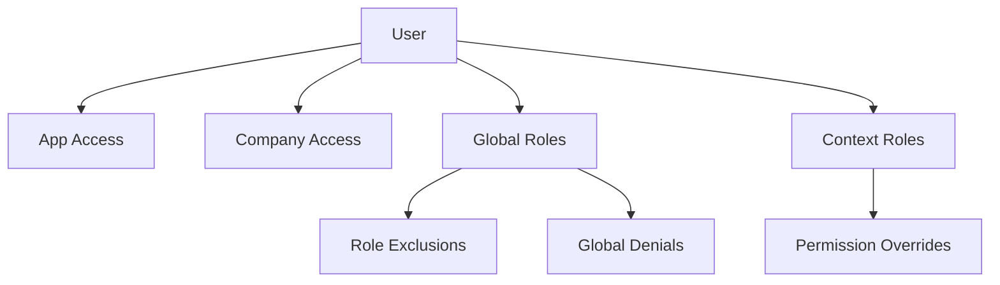

User assignment is the process of granting users access to applications, companies, and roles. NewKipital's flexible assignment model supports global roles, per-company roles, role exclusions, and individual permission overrides.

## Assignment Hierarchy

Users receive permissions through a hierarchical system:



### Assignment Layers

<Steps>
  <Step title="App Assignment">
    User must be granted access to an application (`kpital` or `timewise`)
  </Step>
  
  <Step title="Company Assignment">
    User must be assigned to specific companies they can operate in
  </Step>
  
  <Step title="Role Assignment">
    User receives roles either globally (all companies) or per-company context
  </Step>
  
  <Step title="Fine-Tuning">
    Apply role exclusions and permission overrides for exceptions
  </Step>
</Steps>

## App Assignment

Users must have access to an application before they can use it:

### Assign App to User

```bash Source: user-assignment.service.ts:132
curl -X POST https://api.newkipital.com/user-assignments/apps \
  -H "Content-Type: application/json" \
  -H "Authorization: Bearer YOUR_TOKEN" \
  -d '{
    "idUsuario": 42,
    "idApp": 1
  }'
```

<ParamField body="idUsuario" type="number" required>
  User ID to grant app access
</ParamField>

<ParamField body="idApp" type="number" required>
  Application ID: `1` for kpital, `2` for timewise
</ParamField>

**Required Permission:** Determined by system configuration

### Revoke App Access

```bash Source: user-assignment.service.ts:165
curl -X DELETE https://api.newkipital.com/user-assignments/users/42/apps/1 \
  -H "Authorization: Bearer YOUR_TOKEN"
```

<Warning>
  You cannot revoke the last active application from a user. The system will reject the request with:
  
  ```json
  {
    "statusCode": 409,
    "message": "No se puede revocar la ultima aplicacion activa del usuario"
  }
  ```
</Warning>

### List User Apps

Get all active applications for a user:

```bash
curl -X GET https://api.newkipital.com/user-assignments/users/42/apps \
  -H "Authorization: Bearer YOUR_TOKEN"
```

Response:
```json
[
  {
    "id": 123,
    "idUsuario": 42,
    "idApp": 1,
    "estado": 1,
    "fechaAsignacion": "2025-01-15T10:30:00Z"
  }
]
```

## Company Assignment

Users must be assigned to companies to access company-specific data:

### Assign Company to User

```bash Source: user-assignment.service.ts:206
curl -X POST https://api.newkipital.com/user-assignments/companies \
  -H "Content-Type: application/json" \
  -H "Authorization: Bearer YOUR_TOKEN" \
  -d '{
    "idUsuario": 42,
    "idEmpresa": 5
  }'
```

<Info>
  If the user has no active apps, assigning a company will automatically grant access to the `kpital` app.
</Info>

### Revoke Company Access

```bash Source: user-assignment.service.ts:240
curl -X DELETE https://api.newkipital.com/user-assignments/users/42/companies/5 \
  -H "Authorization: Bearer YOUR_TOKEN"
```

### Replace User Companies

Atomically replace all company assignments for a user:

```bash Source: user-assignment.service.ts:274
curl -X PUT https://api.newkipital.com/user-assignments/users/42/companies \
  -H "Content-Type: application/json" \
  -H "Authorization: Bearer YOUR_TOKEN" \
  -d '{
    "companyIds": [5, 12, 18]
  }'
```

<Tip>
  This is the recommended method for bulk company updates. It ensures consistency by:
  - Activating companies in the list
  - Deactivating companies not in the list
  - Creating new assignments as needed
</Tip>

Response:
```json
{
  "companyIds": [5, 12, 18]
}
```

## Role Assignment

Roles can be assigned globally (all companies) or per specific company-app context.

### Context Roles (Per-Company)

Assign a role to a user for a specific company and application:

```bash Source: user-assignment.service.ts:382
curl -X POST https://api.newkipital.com/user-assignments/roles \
  -H "Content-Type: application/json" \
  -H "Authorization: Bearer YOUR_TOKEN" \
  -d '{
    "idUsuario": 42,
    "idRol": 7,
    "idEmpresa": 5,
    "idApp": 1
  }'
```

<ParamField body="idUsuario" type="number" required>
  User ID
</ParamField>

<ParamField body="idRol" type="number" required>
  Role ID to assign
</ParamField>

<ParamField body="idEmpresa" type="number" required>
  Company ID for this assignment
</ParamField>

<ParamField body="idApp" type="number" required>
  Application ID: `1` for kpital, `2` for timewise
</ParamField>

### Replace Context Roles

Atomically replace all roles for a user in a specific company-app context:

```bash Source: user-assignment.service.ts:452
curl -X PUT https://api.newkipital.com/user-assignments/users/42/context-roles \
  -H "Content-Type: application/json" \
  -H "Authorization: Bearer YOUR_TOKEN" \
  -d '{
    "companyId": 5,
    "appCode": "kpital",
    "roleIds": [7, 12, 15]
  }'
```

<Info>
  This is the **recommended approach** for managing user roles. It ensures:
  - No duplicate role assignments
  - Roles not in the list are deactivated
  - New roles are created
  - Existing roles are reactivated if needed
</Info>

**Use Case Example:**

```text
User: Sarah (ID 42)
Company: Acme Corp (ID 5)
App: kpital
Roles:
  - PAYROLL_ADMIN (ID 7)
  - HR_MANAGER (ID 12)
  - ACCOUNTANT (ID 15)
```

### Global Roles

Global roles apply to **all companies** the user has access to:

```bash Source: user-assignment.service.ts:562
curl -X PUT https://api.newkipital.com/user-assignments/users/42/global-roles \
  -H "Content-Type: application/json" \
  -H "Authorization: Bearer YOUR_TOKEN" \
  -d '{
    "appCode": "kpital",
    "roleIds": [3]
  }'
```

<CodeGroup>
```json Request
{
  "appCode": "kpital",
  "roleIds": [3]  // CONFIG_ADMIN role
}
```

```json Response
{
  "appCode": "kpital",
  "roleIds": [3]
}
```
</CodeGroup>

<Warning>
  **Use global roles sparingly.** They grant permissions across all companies, which may be excessive for most users.
</Warning>

### Get User Roles

Retrieve all active roles for a user:

```bash
curl -X GET "https://api.newkipital.com/user-assignments/users/42/roles?idEmpresa=5&idApp=1" \
  -H "Authorization: Bearer YOUR_TOKEN"
```

### Get User Roles Summary

Get a complete overview of a user's role assignments, including global roles, context roles, exclusions, and overrides:

```bash Source: user-assignment.service.ts:776
curl -X GET "https://api.newkipital.com/user-assignments/users/42/roles-summary?appCode=kpital" \
  -H "Authorization: Bearer YOUR_TOKEN"
```

Response:
```json
{
  "appCode": "kpital",
  "globalRoleIds": [3],
  "globalPermissionDeny": ["payroll:delete"],
  "contextRoles": [
    {
      "companyId": 5,
      "roleIds": [7, 12]
    },
    {
      "companyId": 18,
      "roleIds": [15]
    }
  ],
  "exclusions": [
    {
      "companyId": 5,
      "roleIds": []  // No exclusions for company 5
    }
  ],
  "permissionOverrides": [
    {
      "companyId": 5,
      "allow": ["reports:financial"],
      "deny": []
    }
  ]
}
```

## Role Exclusions

Exclude a global role from specific companies:

### Use Case

John has the `HR_MANAGER` global role but should **not** have HR permissions in Company B:

```bash Source: user-assignment.service.ts:669
curl -X PUT https://api.newkipital.com/user-assignments/users/42/role-exclusions \
  -H "Content-Type: application/json" \
  -H "Authorization: Bearer YOUR_TOKEN" \
  -d '{
    "companyId": 12,
    "appCode": "kpital",
    "roleIds": [8]  // Exclude HR_MANAGER (ID 8) from company 12
  }'
```

<Info>
  Role exclusions **only affect global roles**. They have no effect on context-specific role assignments.
</Info>

### Get Role Exclusions

```bash
curl -X GET "https://api.newkipital.com/user-assignments/users/42/role-exclusions?companyId=12&appCode=kpital" \
  -H "Authorization: Bearer YOUR_TOKEN"
```

Response:
```json
{
  "companyId": 12,
  "appCode": "kpital",
  "roleIds": [8]
}
```

## Permission Overrides

Grant or deny specific permissions for a user in a company-app context:

### Override Types

<CardGroup cols={2}>
  <Card title="ALLOW Override" icon="check" color="#10b981">
    Grant a permission the user doesn't have through roles
  </Card>
  
  <Card title="DENY Override" icon="xmark" color="#ef4444">
    Revoke a permission the user would have through roles
  </Card>
</CardGroup>

### Replace Permission Overrides

```bash Source: user-assignment.service.ts:1029
curl -X PUT https://api.newkipital.com/user-assignments/users/42/permission-overrides \
  -H "Content-Type: application/json" \
  -H "Authorization: Bearer YOUR_TOKEN" \
  -d '{
    "companyId": 5,
    "appCode": "kpital",
    "allow": ["reports:financial", "payroll:view"],
    "deny": ["payroll:delete"]
  }'
```

<ParamField body="companyId" type="number" required>
  Company ID for this override
</ParamField>

<ParamField body="appCode" type="string" required>
  Application code: `kpital` or `timewise`
</ParamField>

<ParamField body="allow" type="array" required>
  Array of permission codes to explicitly grant (e.g., `["payroll:approve"]`)
</ParamField>

<ParamField body="deny" type="array" required>
  Array of permission codes to explicitly deny (e.g., `["payroll:delete"]`)
</ParamField>

<Warning>
  **Validation:** The same permission cannot appear in both `allow` and `deny` arrays. The API will reject such requests:
  
  ```json
  {
    "statusCode": 400,
    "message": "Permisos duplicados en allow y deny: payroll:view"
  }
  ```
</Warning>

### Get Permission Overrides

```bash Source: user-assignment.service.ts:1198
curl -X GET "https://api.newkipital.com/user-assignments/users/42/permission-overrides?companyId=5&appCode=kpital" \
  -H "Authorization: Bearer YOUR_TOKEN"
```

Response:
```json
{
  "idUsuario": 42,
  "companyId": 5,
  "appCode": "kpital",
  "allow": ["reports:financial", "payroll:view"],
  "deny": ["payroll:delete"]
}
```

## Global Permission Denials

Deny a permission globally across **all companies**:

### Use Case

Revoke the `payroll:delete` permission for a user in all companies, regardless of roles:

```bash Source: user-assignment.service.ts:925
curl -X PUT https://api.newkipital.com/user-assignments/users/42/global-denials \
  -H "Content-Type: application/json" \
  -H "Authorization: Bearer YOUR_TOKEN" \
  -d '{
    "appCode": "kpital",
    "deny": ["payroll:delete", "employees:delete"]
  }'
```

<Warning>
  Global denials **override all role permissions**. DENY always wins.
</Warning>

### Get Global Denials

```bash
curl -X GET "https://api.newkipital.com/user-assignments/users/42/global-denials?appCode=kpital" \
  -H "Authorization: Bearer YOUR_TOKEN"
```

Response:
```json
{
  "appCode": "kpital",
  "deny": ["payroll:delete", "employees:delete"]
}
```

## Permission Resolution Example

Given:

```text
User: Alice (ID 42)
Company: Acme Corp (ID 5)
App: kpital

Global Roles:
  - CONFIG_ADMIN (permissions: config:roles, config:permissions, config:users)

Context Roles (Company 5, kpital):
  - PAYROLL_ADMIN (permissions: payroll:view, payroll:edit, payroll:approve, payroll:delete)
  - HR_MANAGER (permissions: employees:list, employees:view, employees:edit)

Global Denials:
  - payroll:delete

Permission Overrides (Company 5, kpital):
  - ALLOW: reports:financial
  - DENY: employees:edit
```

**Resolution:**

<AccordionGroup>
  <Accordion title="✅ config:roles">
    **GRANTED** via Global Role (CONFIG_ADMIN)
  </Accordion>
  
  <Accordion title="✅ payroll:view">
    **GRANTED** via Context Role (PAYROLL_ADMIN)
  </Accordion>
  
  <Accordion title="❌ payroll:delete">
    **DENIED** by Global Denial (overrides PAYROLL_ADMIN role)
  </Accordion>
  
  <Accordion title="✅ reports:financial">
    **GRANTED** via Permission Override ALLOW (not in any role)
  </Accordion>
  
  <Accordion title="❌ employees:edit">
    **DENIED** by Permission Override DENY (overrides HR_MANAGER role)
  </Accordion>
  
  <Accordion title="✅ employees:list">
    **GRANTED** via Context Role (HR_MANAGER)
  </Accordion>
</AccordionGroup>

## Protected Users

### Master User Protection

Users with the `MASTER` role cannot be modified:

```typescript Source: user-assignment.service.ts:1296
private async isProtectedMasterUser(userId: number): Promise<boolean> {
  // Checks if user has MASTER role (context or global)
}
```

<Warning>
  Attempting to modify a MASTER user results in:
  
  ```json
  {
    "statusCode": 409,
    "message": "El usuario MASTER esta protegido y no puede ser modificado"
  }
  ```
</Warning>

### Last Admin Protection

The last user with `config:*` permissions cannot be modified:

```typescript Source: user-assignment.service.ts:1324
private async isConfigAdminUser(userId: number): Promise<boolean> {
  // Checks if user has config:* permissions
}
```

<Info>
  This prevents accidentally locking all administrators out of the system.
</Info>

## Self-Modification Prevention

Users cannot modify their own critical assignments:

```typescript Source: user-assignment.service.ts:1271
if (actorUserId && targetUserId === actorUserId) {
  throw new ConflictException(
    'No puede modificar su propio usuario en esta operacion critica',
  );
}
```

<Warning>
  Prevents users from accidentally removing their own administrative access.
</Warning>

## Real-Time Updates

When user assignments change, the system automatically:

1. **Bumps user permission version** - Invalidates cached permissions
2. **Sends WebSocket notification** - Live users receive updates

```typescript Source: user-assignment.service.ts:84
private async bumpUserAuthz(userId: number): Promise<void> {
  await this.authzVersionService.bumpUsers([userId]);
  this.authzRealtime.notifyUsers([userId], {
    type: 'permissions.changed',
    reason: 'user.assignment.changed',
    at: new Date().toISOString(),
  });
}
```

## Audit Trail

All assignment changes are published to the audit outbox:

```typescript Source: user-assignment.service.ts:57
private publishAudit(params: {
  accion: string;
  entidad: string;
  entidadId?: string | number | null;
  actorUserId?: number | null;
  descripcion: string;
  payloadAfter?: Record<string, unknown>;
  payloadBefore?: Record<string, unknown>;
  companyContextId?: number | null;
}): void
```

Example audit log:

```json
{
  "modulo": "user_assignments",
  "accion": "replace_context_roles",
  "entidad": "user_role",
  "entidadId": 42,
  "actorUserId": 1,
  "descripcion": "Roles modificados para Sarah Johnson (ID 42) en Acme Corp (ID 5) (kpital). Antes: Accountant (ACCOUNTANT). Después: Payroll Administrator (PAYROLL_ADMIN), HR Manager (HR_MANAGER).",
  "companyContextId": 5,
  "payloadBefore": {
    "idUsuario": 42,
    "companyId": 5,
    "appCode": "kpital",
    "roleIds": [15]
  },
  "payloadAfter": {
    "idUsuario": 42,
    "companyId": 5,
    "appCode": "kpital",
    "roleIds": [7, 12]
  }
}
```

## Best Practices

<CardGroup cols={2}>
  <Card title="Use Context Roles" icon="building">
    Prefer per-company role assignments over global roles for better security isolation.
  </Card>
  
  <Card title="Minimize Overrides" icon="wrench">
    Use permission overrides sparingly. If many users need the same override, consider creating a new role.
  </Card>
  
  <Card title="Batch Operations" icon="layer-group">
    Use replace operations (`PUT /users/{id}/context-roles`) instead of individual assignments for consistency.
  </Card>
  
  <Card title="Audit Regularly" icon="magnifying-glass">
    Review user assignments quarterly to ensure least-privilege access.
  </Card>
</CardGroup>

## Common Workflows

<Tabs>
  <Tab title="New Employee">
    ```bash
    # 1. Grant app access
    POST /user-assignments/apps
    { "idUsuario": 42, "idApp": 1 }

    # 2. Assign to companies
    PUT /user-assignments/users/42/companies
    { "companyIds": [5, 12] }

    # 3. Assign roles for each company
    PUT /user-assignments/users/42/context-roles
    { "companyId": 5, "appCode": "kpital", "roleIds": [15] }

    PUT /user-assignments/users/42/context-roles
    { "companyId": 12, "appCode": "kpital", "roleIds": [15] }
    ```
  </Tab>
  
  <Tab title="Promotion">
    ```bash
    # User promoted from EMPLOYEE to PAYROLL_ADMIN in company 5
    PUT /user-assignments/users/42/context-roles
    {
      "companyId": 5,
      "appCode": "kpital",
      "roleIds": [7]  // PAYROLL_ADMIN
    }
    ```
  </Tab>
  
  <Tab title="Exception Handling">
    ```bash
    # User needs special report access but should not delete payroll
    PUT /user-assignments/users/42/permission-overrides
    {
      "companyId": 5,
      "appCode": "kpital",
      "allow": ["reports:financial"],
      "deny": ["payroll:delete"]
    }
    ```
  </Tab>
  
  <Tab title="Global Admin">
    ```bash
    # Grant global admin role
    PUT /user-assignments/users/42/global-roles
    { "appCode": "kpital", "roleIds": [3] }

    # Exclude from specific company
    PUT /user-assignments/users/42/role-exclusions
    { "companyId": 18, "appCode": "kpital", "roleIds": [3] }
    ```
  </Tab>
</Tabs>

## Next Steps

<CardGroup cols={2}>
  <Card title="Access Control Overview" icon="shield" href="/access-control/overview">
    Understand the permission model
  </Card>
  
  <Card title="Manage Roles" icon="users-gear" href="/access-control/roles">
    Create and configure roles
  </Card>
</CardGroup>