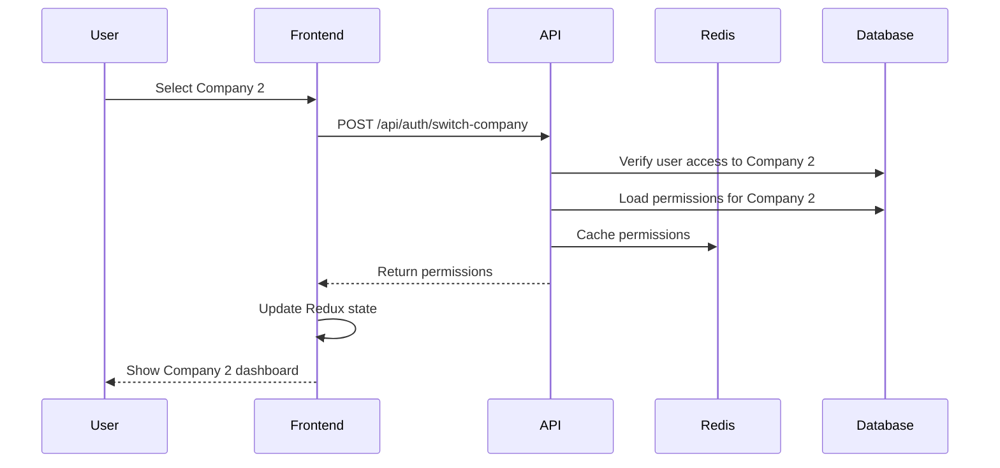

NewKipital is an enterprise-grade HR and payroll management platform built with modern technologies and architectural patterns to ensure scalability, security, and maintainability.

## Tech stack

NewKipital uses a modern full-stack JavaScript/TypeScript architecture.

### Backend

The API is built with **NestJS**, a progressive Node.js framework that provides enterprise-level structure and TypeScript support.

<CodeGroup>
  ```json package.json
  {
    "dependencies": {
      "@nestjs/common": "^11.0.1",
      "@nestjs/core": "^11.0.1",
      "@nestjs/typeorm": "^11.0.0",
      "@nestjs/jwt": "^11.0.2",
      "@nestjs/passport": "^11.0.5",
      "typeorm": "^0.3.28",
      "mysql2": "^3.17.4",
      "bcrypt": "^6.0.0",
      "ioredis": "^5.10.0",
      "socket.io": "^4.8.3"
    }
  }
  ```

  ```typescript main.ts
  // api/src/main.ts
  async function bootstrap() {
    const app = await NestFactory.create(AppModule);

    app.use(cookieParser());
    app.use(helmet());

    app.useGlobalFilters(new GlobalExceptionFilter());
    app.useGlobalInterceptors(new LoggingInterceptor());

    const configService = app.get(ConfigService);
    const isDev = configService.get<string>('NODE_ENV') === 'development';

    const allowedOrigins = isDev
      ? ['http://localhost:5173', 'http://localhost:5174']
      : ['https://kpital360.com', 'https://timewise.kpital360.com'];

    app.enableCors({
      origin: allowedOrigins,
      methods: ['GET', 'POST', 'PUT', 'PATCH', 'DELETE', 'OPTIONS'],
      credentials: true,
    });

    app.setGlobalPrefix('api');

    const port = configService.get<number>('PORT', 3000);
    await app.listen(port);
  }
  bootstrap();
  ```
</CodeGroup>

**Key technologies:**
- **TypeORM**: Database ORM with MySQL support
- **Passport & JWT**: Authentication and authorization
- **bcrypt**: Password hashing (cost factor 10)
- **Redis (ioredis)**: Rate limiting and caching
- **Socket.io**: Real-time permission updates via WebSockets
- **Helmet**: Security headers middleware
- **class-validator**: Request validation

### Frontend

The UI is built with **React 19** and **Ant Design**, providing a modern and responsive user experience.

<CodeGroup>
  ```json package.json
  {
    "dependencies": {
      "react": "^19.2.0",
      "react-dom": "^19.2.0",
      "react-router-dom": "^7.13.0",
      "antd": "^6.3.0",
      "@ant-design/icons": "^6.1.0",
      "@reduxjs/toolkit": "^2.11.2",
      "react-redux": "^9.2.0",
      "@tanstack/react-query": "^5.90.21",
      "socket.io-client": "4.8"
    }
  }
  ```

  ```bash Environment
  VITE_API_URL=http://localhost:3000/api
  VITE_MSAL_CLIENT_ID=<your-microsoft-app-id>
  VITE_MSAL_AUTHORITY=https://login.microsoftonline.com/<tenant-id>
  VITE_MSAL_REDIRECT_URI_PRODUCCION=http://localhost:5173/auth/login
  VITE_MICROSOFT_SCOPES=openid profile email
  ```
</CodeGroup>

**Key technologies:**
- **Vite**: Fast build tool and dev server
- **Redux Toolkit**: State management
- **TanStack Query**: Server state and caching
- **React Router**: Client-side routing
- **Ant Design**: Component library
- **TypeScript**: Type safety

### Database

NewKipital uses **MySQL** as its primary database with a carefully designed schema that enforces enterprise-level data integrity.

<CodeGroup>
  ```typescript Database Config
  // api/src/config/database.config.ts
  export const databaseConfig: TypeOrmModuleAsyncOptions = {
    useFactory: (config: ConfigService) => ({
      type: 'mysql' as const,
      host: config.get<string>('DB_HOST', 'localhost'),
      port: config.get<number>('DB_PORT', 3306),
      username: config.get<string>('DB_USERNAME', 'root'),
      password: config.get<string>('DB_PASSWORD', ''),
      database: config.get<string>('DB_DATABASE', 'kpital360'),
      entities: [__dirname + '/../modules/**/entities/*.entity{.ts,.js}'],
      migrations: [__dirname + '/../database/migrations/*{.ts,.js}'],
      synchronize: false,
      logging: false,
      charset: 'utf8mb4',
      poolSize: config.get<number>('DB_POOL_SIZE', 10),
      extra: {
        waitForConnections: true,
        connectionLimit: config.get<number>('DB_POOL_SIZE', 10),
        idleTimeout: config.get<number>('DB_POOL_IDLE_TIMEOUT_MS', 240000),
        connectTimeout: config.get<number>('DB_CONNECT_TIMEOUT_MS', 60000),
        enableKeepAlive: true,
      },
    }),
    inject: [ConfigService],
  };
  ```

  ```sql Core Tables
  -- Companies (root aggregate)
  sys_empresas
    - id_empresa (PK)
    - nombre_empresa
    - cedula_empresa (UNIQUE)
    - prefijo_empresa (UNIQUE)
    - estado_empresa
    - fecha_creacion_empresa

  -- Users (authentication)
  sys_usuarios
    - id_usuario (PK)
    - email_usuario (UNIQUE)
    - password_hash_usuario
    - microsoft_oid_usuario
    - microsoft_tid_usuario
    - estado_usuario

  -- User-Company associations
  sys_usuario_empresa
    - id_usuario_empresa (PK)
    - id_usuario (FK)
    - id_empresa (FK)

  -- Access control
  sys_apps
  sys_roles
  sys_permissions
  sys_usuario_app
  sys_usuario_rol
  sys_rol_permiso
  ```
</CodeGroup>

<Note>
  NewKipital follows strict database principles:
  - **No physical deletes**: Only logical inactivation via `estado` fields
  - **No cascade deletes**: Referential integrity is always maintained
  - **Audit trails**: All entities track creation and modification timestamps and users
</Note>

## Project structure

The codebase is organized into clear, modular directories.

### Backend structure

```
api/
├── src/
│   ├── modules/              # Feature modules
│   │   ├── auth/            # Authentication & users
│   │   │   ├── auth.controller.ts
│   │   │   ├── auth.service.ts
│   │   │   ├── auth-audit.service.ts
│   │   │   ├── auth-rate-limit.service.ts
│   │   │   ├── microsoft-auth.service.ts
│   │   │   ├── users.service.ts
│   │   │   └── entities/
│   │   │       ├── user.entity.ts
│   │   │       └── refresh-session.entity.ts
│   │   ├── companies/       # Company management
│   │   ├── employees/       # Employee records
│   │   ├── payroll/         # Payroll processing
│   │   ├── payroll-articles/
│   │   ├── payroll-movements/
│   │   ├── payroll-holidays/
│   │   ├── personal-actions/
│   │   ├── departments/
│   │   ├── positions/
│   │   ├── projects/
│   │   ├── classes/
│   │   ├── accounting-accounts/
│   │   ├── access-control/  # RBAC system
│   │   ├── authz/           # Authorization & permissions
│   │   ├── integration/     # Domain events & audit
│   │   ├── notifications/
│   │   └── health/
│   ├── common/              # Shared utilities
│   │   ├── guards/          # JwtAuthGuard, CsrfGuard, PermissionsGuard
│   │   ├── decorators/      # @CurrentUser, @RequirePermissions, @Public
│   │   ├── filters/         # Exception handling
│   │   ├── interceptors/    # Logging, transformation
│   │   └── strategies/      # JWT strategy
│   ├── config/              # Configuration
│   │   ├── database.config.ts
│   │   ├── jwt.config.ts
│   │   ├── redis.config.ts
│   │   └── cookie.config.ts
│   ├── database/
│   │   ├── migrations/      # TypeORM migrations
│   │   └── stored-procedures/
│   ├── workflows/           # Business workflows
│   ├── app.module.ts
│   └── main.ts
├── test/                    # E2E tests
└── package.json
```

<Note>
  Each module follows NestJS conventions with controllers, services, DTOs, and entities co-located.
</Note>

### Frontend structure

```
frontend/
├── src/
│   ├── pages/               # Route components
│   │   ├── public/
│   │   │   └── LoginPage.tsx
│   │   └── private/
│   │       ├── dashboard/
│   │       ├── companies/
│   │       ├── employees/
│   │       ├── payroll/
│   │       └── settings/
│   ├── components/          # Reusable UI components
│   ├── layouts/             # Layout wrappers
│   ├── store/               # Redux slices
│   │   └── slices/
│   │       ├── authSlice.ts
│   │       ├── activeAppSlice.ts
│   │       ├── activeCompanySlice.ts
│   │       └── permissionsSlice.ts
│   ├── api/                 # API client functions
│   ├── queries/             # TanStack Query hooks
│   ├── hooks/               # Custom React hooks
│   ├── guards/              # Route guards
│   ├── contexts/            # React contexts
│   ├── lib/                 # Utilities
│   ├── router/              # Route configuration
│   └── main.tsx
└── package.json
```

## Multi-tenant architecture

NewKipital is designed from the ground up as a multi-tenant system where multiple companies share the same application instance while maintaining strict data isolation.

### Tenant isolation model

**Shared database, partitioned by company:**
- All companies use the same database tables
- Every query is scoped by `id_empresa` (company ID)
- Row-level security through application logic

```typescript
// Example: Companies module enforces tenant boundaries
@Controller('companies')
export class CompaniesController {
  @RequirePermissions('company:view')
  @Get()
  findAll(
    @CurrentUser() user: { userId: number },
  ) {
    // Service automatically filters to user's accessible companies
    return this.service.findAll(user.userId);
  }

  @RequirePermissions('company:view')
  @Get(':id')
  findOne(
    @Param('id', ParseIntPipe) id: number,
    @CurrentUser() user: { userId: number },
  ) {
    // Validates user has access to this specific company
    return this.service.findOne(id, user.userId);
  }
}
```

### User-company associations

Users are linked to companies through the `sys_usuario_empresa` table:

```typescript
// User entity (sys_usuarios)
@Entity('sys_usuarios')
export class User {
  @PrimaryGeneratedColumn({ name: 'id_usuario' })
  id: number;

  @Column({ name: 'email_usuario', unique: true })
  email: string;

  @Column({ name: 'password_hash_usuario', nullable: true })
  passwordHash: string | null;

  @Column({ name: 'microsoft_oid_usuario', nullable: true })
  microsoftOid: string | null;

  @Column({ name: 'estado_usuario', default: 1 })
  estado: number;
}

// Company entity (sys_empresas)
@Entity('sys_empresas')
export class Company {
  @PrimaryGeneratedColumn({ name: 'id_empresa' })
  id: number;

  @Column({ name: 'nombre_empresa' })
  nombre: string;

  @Column({ name: 'cedula_empresa', unique: true })
  cedula: string;

  @Column({ name: 'prefijo_empresa', unique: true })
  prefijo: string;

  @Column({ name: 'estado_empresa', default: 1 })
  estado: number;
}
```

### Context switching

Users can switch between companies and apps without re-authenticating:



## Authentication flow

NewKipital supports dual authentication: traditional email/password and Microsoft SSO.

### Traditional authentication

<Steps>
  <Step title="User submits credentials">
    ```typescript
    POST /api/auth/login
    {
      "email": "user@company.com",
      "password": "secure-password"
    }
    ```
  </Step>

  <Step title="Backend validates credentials">
    ```typescript
    // auth.service.ts
    async login(email: string, password: string, ip: string, userAgent: string) {
      const user = await this.usersService.findByEmail(email);
      if (!user || !user.passwordHash) {
        throw new UnauthorizedException('Credenciales invalidas');
      }

      // Verify password with bcrypt
      const valid = await bcrypt.compare(password, user.passwordHash);
      if (!valid) {
        await this.incrementFailedAttempts(user.id);
        throw new UnauthorizedException('Credenciales invalidas');
      }

      // Generate JWT tokens
      const accessToken = this.jwtService.sign({ userId: user.id, email: user.email });
      const refreshToken = await this.createRefreshToken(user.id);
      const csrfToken = crypto.randomUUID();

      return { accessToken, refreshToken, csrfToken, session };
    }
    ```
  </Step>

  <Step title="Tokens stored in HTTP-only cookies">
    ```typescript
    // Cookie configuration with security flags
    res.cookie('kpital_access_token', accessToken, {
      httpOnly: true,
      secure: true, // HTTPS only in production
      sameSite: 'strict',
      maxAge: 15 * 60 * 1000, // 15 minutes
    });

    res.cookie('kpital_refresh_token', refreshToken, {
      httpOnly: true,
      secure: true,
      sameSite: 'strict',
      maxAge: 7 * 24 * 60 * 60 * 1000, // 7 days
    });

    res.cookie('kpital_csrf_token', csrfToken, {
      httpOnly: false, // Readable by JS for CSRF protection
      secure: true,
      sameSite: 'strict',
    });
    ```
  </Step>
</Steps>

### Microsoft SSO authentication

Microsoft SSO uses OAuth 2.0 with PKCE (Proof Key for Code Exchange) for enhanced security.

<Steps>
  <Step title="Initiate OAuth flow">
    Frontend generates a code verifier and challenge, then opens Microsoft's authorization endpoint in a popup.

    ```typescript
    // LoginPage.tsx
    const codeVerifier = generateRandomString(96);
    const codeChallenge = await createCodeChallenge(codeVerifier);

    const authUrl = new URL(`${authority}/oauth2/v2.0/authorize`);
    authUrl.searchParams.set('client_id', microsoftClientId);
    authUrl.searchParams.set('response_type', 'code');
    authUrl.searchParams.set('redirect_uri', redirectUri);
    authUrl.searchParams.set('scope', 'openid profile email User.Read');
    authUrl.searchParams.set('code_challenge', codeChallenge);
    authUrl.searchParams.set('code_challenge_method', 'S256');

    window.open(authUrl.toString(), 'microsoft-login', 'popup=yes,width=560,height=720');
    ```
  </Step>

  <Step title="User authenticates with Microsoft">
    Microsoft validates the user's credentials and redirects back with an authorization code.
  </Step>

  <Step title="Exchange code for tokens">
    Frontend exchanges the authorization code for Microsoft tokens, then validates the ID token.

    ```typescript
    const tokenResponse = await fetch(`${authority}/oauth2/v2.0/token`, {
      method: 'POST',
      body: new URLSearchParams({
        client_id: microsoftClientId,
        grant_type: 'authorization_code',
        code: authorizationCode,
        redirect_uri: redirectUri,
        code_verifier: codeVerifier,
      }),
    });

    const { id_token, access_token } = await tokenResponse.json();
    const claims = decodeJwtPayload(id_token);
    ```
  </Step>

  <Step title="Backend validates tenant and domain">
    ```typescript
    // auth.controller.ts:201
    @Post('validate')
    async validateMicrosoft(@Body() dto: ValidateMicrosoftDto) {
      // Validate tenant ID
      const allowedTenant = this.config.get<string>('MICROSOFT_TENANT_ID');
      if (allowedTenant && dto.tenantId !== allowedTenant) {
        throw new UnauthorizedException('Tenant not allowed');
      }

      // Validate email domain
      const allowedDomains = this.config.get<string>('MICROSOFT_ALLOWED_DOMAINS')
        .split(',')
        .map(d => d.trim().toLowerCase());
      const emailDomain = dto.email.split('@')[1]?.toLowerCase();

      if (!allowedDomains.includes(emailDomain)) {
        throw new ForbiddenException('Email domain not allowed');
      }

      // Create or find user by microsoft_oid_usuario and microsoft_tid_usuario
      const issued = await this.authService.loginWithMicrosoftValidatedUser(
        dto.id,
        dto.tenantId,
        dto.email,
        ip,
        userAgent,
      );

      return issued;
    }
    ```
  </Step>

  <Step title="Session established">
    Backend issues NewKipital JWT tokens and stores them in HTTP-only cookies, same as traditional authentication.
  </Step>
</Steps>

<Warning>
  Microsoft SSO requires proper configuration of Azure AD application registration with redirect URIs, API permissions (User.Read), and token configuration.
</Warning>

## Authorization system

NewKipital implements a sophisticated role-based access control (RBAC) system with support for overrides and real-time updates.

### Permission evaluation

Permissions are evaluated in this order (from highest to lowest priority):

1. **Global permission denies** (`sys_usuario_permiso_global_deny`) - Always blocks access
2. **User permission overrides** (`sys_usuario_permiso_override`) - Individual grants/denies
3. **Role permissions** (`sys_rol_permiso` via `sys_usuario_rol`) - Standard RBAC
4. **Role exclusions** (`sys_usuario_rol_exclusion`) - Removes specific permissions from a role

```typescript
// Permission guard checks on every request
@Injectable()
export class PermissionsGuard implements CanActivate {
  async canActivate(context: ExecutionContext): Promise<boolean> {
    const requiredPermissions = this.reflector.get<string[]>(
      'permissions',
      context.getHandler(),
    );

    if (!requiredPermissions?.length) {
      return true;
    }

    const request = context.switchToHttp().getRequest();
    const user = request.user; // From JWT

    const userPermissions = await this.authzService.resolvePermissions(
      user.userId,
      user.companyId,
      user.appCode,
    );

    return requiredPermissions.every(p => userPermissions.includes(p));
  }
}
```

### Real-time permission updates

When permissions change, users receive updates instantly via Server-Sent Events (SSE):

```typescript
// Frontend connects to permission stream
GET /api/auth/permissions-stream

// Backend pushes updates when permissions change
@Get('permissions-stream')
permissionsStream(@CurrentUser() reqUser, @Res() res: Response): void {
  res.setHeader('Content-Type', 'text/event-stream');
  res.setHeader('Cache-Control', 'no-cache');
  res.setHeader('Connection', 'keep-alive');

  const close = this.authzRealtime.register(reqUser.userId, res);
  req.on('close', () => close());
}
```

This ensures users don't need to log out and back in when their permissions change.

## Security features

NewKipital implements multiple layers of security:

<CardGroup cols={2}>
  <Card title="Authentication" icon="lock">
    - JWT tokens with short expiry (15 minutes)
    - Refresh token rotation
    - bcrypt password hashing
    - Microsoft SSO with PKCE
    - HTTP-only cookies
  </Card>

  <Card title="Authorization" icon="shield">
    - Role-based access control (RBAC)
    - Permission guards on all endpoints
    - Multi-tenant data isolation
    - Audit logging for all auth events
  </Card>

  <Card title="CSRF Protection" icon="shield-halved">
    - CSRF tokens in separate cookies
    - CsrfGuard validates on state-changing requests
    - SameSite cookie policy
  </Card>

  <Card title="Rate Limiting" icon="gauge-high">
    - Redis-backed rate limiter
    - Per-IP limits on auth endpoints
    - Failed login attempt tracking
    - Automatic account lockout
  </Card>
</CardGroup>

```typescript
// Rate limiting example
@Post('login')
async login(@Body() dto: LoginDto, @Req() req: Request) {
  const ip = req.headers['x-forwarded-for']?.split(',')[0] || req.ip;
  await this.rateLimit.consume(`login:${ip}`, 5, 60_000); // 5 attempts per minute

  // ... authentication logic
}
```

## Performance optimizations

### Caching strategy

- **Redis caching** for frequently accessed data (permissions, user sessions)
- **TanStack Query** on frontend for server state caching
- **Database connection pooling** with configurable limits

### Database optimizations

- **Indexes** on frequently queried columns (`IDX_empresa_cedula`, `IDX_usuario_email`, etc.)
- **Efficient queries** with TypeORM query builder
- **No N+1 queries** - eager loading with proper joins

```typescript
// Example: Efficient user loading with relations
const user = await this.userRepository.findOne({
  where: { id: userId },
  relations: ['userCompanies.company', 'userRoles.role.permissions'],
});
```

## Deployment considerations

### Environment variables

<Tabs>
  <Tab title="Backend (API)">
    ```bash
    # Server
    NODE_ENV=production
    PORT=3000

    # Database
    DB_HOST=localhost
    DB_PORT=3306
    DB_USERNAME=kpital_user
    DB_PASSWORD=secure_password
    DB_DATABASE=kpital360
    DB_POOL_SIZE=10

    # JWT
    JWT_SECRET=your-secret-key
    JWT_EXPIRES_IN=15m
    REFRESH_TOKEN_EXPIRES_IN=7d

    # Redis
    REDIS_HOST=localhost
    REDIS_PORT=6379

    # Microsoft SSO
    MICROSOFT_TENANT_ID=your-tenant-id
    MICROSOFT_ALLOWED_DOMAINS=company.com,partner.com

    # Cookies
    COOKIE_DOMAIN=.kpital360.com
    COOKIE_SECURE=true
    ```
  </Tab>

  <Tab title="Frontend">
    ```bash
    VITE_API_URL=https://api.kpital360.com/api
    VITE_MSAL_CLIENT_ID=your-microsoft-app-id
    VITE_MSAL_AUTHORITY=https://login.microsoftonline.com/your-tenant-id
    VITE_MSAL_REDIRECT_URI_PRODUCCION=https://kpital360.com/auth/login
    VITE_MICROSOFT_SCOPES=openid profile email User.Read
    ```
  </Tab>
</Tabs>

### Infrastructure requirements

- **Node.js** 18+ for backend
- **MySQL** 8.0+ for database
- **Redis** 6+ for caching and rate limiting
- **Reverse proxy** (Nginx/Apache) for SSL termination and load balancing
- **HTTPS** required in production for secure cookies

## Next steps

Now that you understand the architecture:

<CardGroup cols={2}>
  <Card title="Quickstart guide" icon="rocket" href="/quickstart">
    Set up your first account and company
  </Card>
  <Card title="API reference" icon="code" href="/api-reference">
    Explore all available endpoints
  </Card>
  <Card title="Deployment guide" icon="server" href="/deployment">
    Deploy NewKipital to production
  </Card>
  <Card title="Contributing" icon="code-branch" href="/contributing">
    Contribute to the project
  </Card>
</CardGroup>
