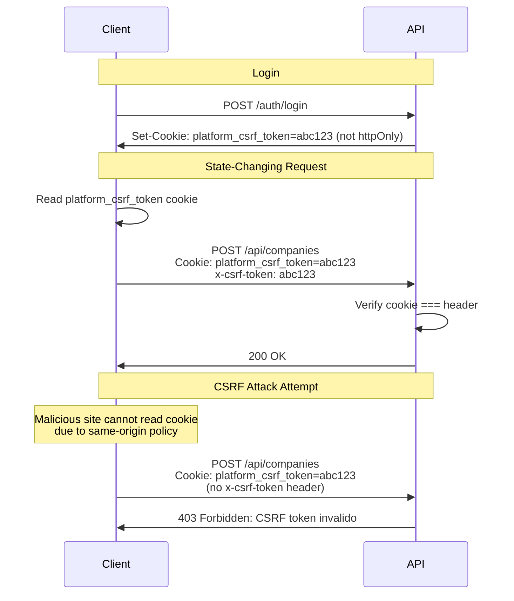

## Overview

NewKipital implements **CSRF (Cross-Site Request Forgery) protection** using the **double-submit cookie pattern** to prevent unauthorized state-changing operations.

CSRF protection applies to all **mutating HTTP methods**:
- `POST`
- `PUT`
- `PATCH`
- `DELETE`

Read-only operations (`GET`, `HEAD`, `OPTIONS`) are exempt.

## What is CSRF?

CSRF is an attack where a malicious website tricks a user's browser into making unwanted requests to your application using the user's credentials.

### Attack Example

```html
<!-- Malicious website: evil.com -->
<form action="https://app.kpital360.com/api/companies" method="POST">
  <input type="hidden" name="action" value="delete" />
  <input type="hidden" name="id" value="123" />
</form>
<script>
  // Auto-submit form when user visits page
  document.forms[0].submit();
</script>
```

If the user is logged into NewKipital, their cookies are automatically sent with the request, potentially allowing unauthorized deletion.

<Warning>
**Without CSRF protection**, any website the user visits could perform actions on their behalf.
</Warning>

## Double-Submit Cookie Pattern

NewKipital uses the **double-submit cookie pattern**:

1. Server generates a random CSRF token on login/refresh
2. Token is stored in a **non-httpOnly cookie** (readable by JavaScript)
3. Client reads the token from the cookie
4. Client includes the token as a **custom header** in requests
5. Server verifies the cookie value matches the header value



<Info>
Malicious websites can cause the browser to send cookies, but **cannot read cookies** or **set custom headers** due to the browser's same-origin policy.
</Info>

## Implementation

### Server: Token Generation

CSRF tokens are random UUIDs generated during authentication:

```typescript
import { randomUUID } from 'crypto';

private async issueSessionTokens(
  user: User,
  ip?: string,
  userAgent?: string,
): Promise<IssuedSession> {
  const jti = randomUUID();
  const accessToken = this.signAccessToken(user);
  const refreshToken = this.signRefreshToken(user, jti);

  await this.persistRefreshSession(user.id, jti, refreshToken, ip, userAgent);

  const session = await this.buildSession(user);

  return {
    accessToken,
    refreshToken,
    csrfToken: randomUUID(),  // CSRF token generation
    session,
  };
}
```

See `auth.service.ts:569`

### Server: Cookie Configuration

CSRF tokens are stored with specific cookie attributes:

```typescript
export function getCsrfCookieOptions(config: ConfigService): CookieOptions {
  const isDev = config.get<string>('NODE_ENV') === 'development';

  return {
    httpOnly: false,  // JavaScript MUST be able to read this
    secure: !isDev,
    sameSite: isDev ? 'lax' : 'none',
    domain: isDev ? undefined : '.kpital360.com',
    path: '/',
    maxAge: 30 * 24 * 60 * 60 * 1000,  // 30 days
  };
}
```

See `cookie.config.ts:40`

<Warning>
The CSRF cookie **must not be httpOnly**. If it is, JavaScript cannot read it to include in headers.
</Warning>

### Server: Validation Guard

The `CsrfGuard` validates tokens on mutating requests:

```typescript
import {
  CanActivate,
  ExecutionContext,
  ForbiddenException,
  Injectable,
} from '@nestjs/common';
import { Reflector } from '@nestjs/core';
import { Request } from 'express';
import { SKIP_CSRF_KEY } from '../decorators/skip-csrf.decorator';
import { CSRF_COOKIE_NAME, CSRF_HEADER_NAME } from '../../config/cookie.config';

const MUTATING_METHODS = new Set(['POST', 'PUT', 'PATCH', 'DELETE']);

@Injectable()
export class CsrfGuard implements CanActivate {
  constructor(private readonly reflector: Reflector) {}

  canActivate(context: ExecutionContext): boolean {
    const request = context.switchToHttp().getRequest<Request>();
    
    // Skip in test environment if configured
    const isTestEnv = process.env.NODE_ENV === 'test';
    if (isTestEnv && process.env.E2E_DISABLE_CSRF === 'true') {
      return true;
    }
    
    // Only check mutating methods
    if (!MUTATING_METHODS.has(request.method.toUpperCase())) {
      return true;
    }

    // Check for @SkipCsrf() decorator
    const skipCsrf = this.reflector.getAllAndOverride<boolean>(SKIP_CSRF_KEY, [
      context.getHandler(),
      context.getClass(),
    ]);
    if (skipCsrf) {
      return true;
    }

    // Validate token
    const csrfCookie = request.cookies?.[CSRF_COOKIE_NAME];
    const csrfHeader = request.headers[CSRF_HEADER_NAME] as string | undefined;

    if (!csrfCookie || !csrfHeader || csrfCookie !== csrfHeader) {
      throw new ForbiddenException('CSRF token invalido o ausente');
    }

    return true;
  }
}
```

See `csrf.guard.ts:14`

### Server: Global Guard Registration

The CSRF guard is registered globally in the application:

```typescript
import { APP_GUARD } from '@nestjs/core';
import { CsrfGuard } from './common/guards/csrf.guard';

@Module({
  providers: [
    {
      provide: APP_GUARD,
      useClass: CsrfGuard,
    },
  ],
})
export class AppModule {}
```

### Server: Skipping CSRF Protection

Public endpoints (login, refresh) skip CSRF validation using the `@SkipCsrf()` decorator:

```typescript
import { SetMetadata } from '@nestjs/common';

export const SKIP_CSRF_KEY = 'skipCsrf';
export const SkipCsrf = () => SetMetadata(SKIP_CSRF_KEY, true);
```

**Usage:**

```typescript
@Public()
@SkipCsrf()
@Post('login')
async login(@Body() dto: LoginDto) {
  // Login doesn't require CSRF token because user isn't authenticated yet
}

@Public()
@Post('refresh')
async refresh(@Req() req: Request) {
  // Refresh is idempotent and doesn't require CSRF
}
```

See `auth.controller.ts:113`, `auth.controller.ts:199`, `auth.controller.ts:307`

<Info>
Login and initial authentication endpoints skip CSRF because the user doesn't have a token yet. These endpoints rely on rate limiting instead.
</Info>

## Client Implementation

### Reading the CSRF Token

```typescript
function getCsrfToken(): string {
  const match = document.cookie.match(/platform_csrf_token=([^;]+)/);
  return match ? match[1] : '';
}
```

### Including in Requests

#### Fetch API

```typescript
const csrfToken = getCsrfToken();

const response = await fetch('/api/companies', {
  method: 'POST',
  headers: {
    'Content-Type': 'application/json',
    'x-csrf-token': csrfToken,  // CSRF token header
  },
  body: JSON.stringify({ nombre: 'New Company' }),
  credentials: 'include',  // Send cookies
});
```

#### Axios

```typescript
import axios from 'axios';

function getCsrfToken(): string {
  const match = document.cookie.match(/platform_csrf_token=([^;]+)/);
  return match ? match[1] : '';
}

// Create axios instance with interceptor
const api = axios.create({
  baseURL: '/api',
  withCredentials: true,  // Send cookies
});

// Add CSRF token to all mutating requests
api.interceptors.request.use((config) => {
  if (['post', 'put', 'patch', 'delete'].includes(config.method || '')) {
    config.headers['x-csrf-token'] = getCsrfToken();
  }
  return config;
});

// Usage
await api.post('/companies', { nombre: 'New Company' });
```

#### React Hook

```typescript
import { useEffect, useState } from 'react';

function useCsrfToken() {
  const [csrfToken, setCsrfToken] = useState<string>('');

  useEffect(() => {
    const match = document.cookie.match(/platform_csrf_token=([^;]+)/);
    setCsrfToken(match ? match[1] : '');
  }, []);

  return csrfToken;
}

// Usage in component
function CreateCompanyForm() {
  const csrfToken = useCsrfToken();

  const handleSubmit = async (data: FormData) => {
    await fetch('/api/companies', {
      method: 'POST',
      headers: {
        'Content-Type': 'application/json',
        'x-csrf-token': csrfToken,
      },
      body: JSON.stringify(data),
      credentials: 'include',
    });
  };

  return <form onSubmit={handleSubmit}>...</form>;
}
```

## Error Handling

### 403 Forbidden Response

When CSRF validation fails, the server returns:

```json
{
  "statusCode": 403,
  "message": "CSRF token invalido o ausente"
}
```

### Client Error Handling

```typescript
try {
  const response = await fetch('/api/companies', {
    method: 'POST',
    headers: {
      'Content-Type': 'application/json',
      'x-csrf-token': getCsrfToken(),
    },
    body: JSON.stringify(data),
    credentials: 'include',
  });

  if (response.status === 403) {
    // CSRF token missing or invalid
    // Possible causes:
    // 1. Token cookie expired or deleted
    // 2. Token not included in header
    // 3. User logged out in another tab
    
    // Try refreshing session
    await refreshSession();
    
    // Retry request
    return fetch('/api/companies', { ... });
  }

  const data = await response.json();
  return data;
} catch (error) {
  console.error('Request failed:', error);
}
```

## Testing

### Disabling CSRF in Tests

CSRF can be disabled for E2E tests:

```bash
NODE_ENV=test E2E_DISABLE_CSRF=true npm run test:e2e
```

The guard checks this configuration:

```typescript
const isTestEnv = process.env.NODE_ENV === 'test';
if (isTestEnv && process.env.E2E_DISABLE_CSRF === 'true') {
  return true;  // Skip CSRF validation
}
```

### Testing with CSRF Enabled

```typescript
import { Test } from '@nestjs/testing';
import * as request from 'supertest';

describe('Companies API (with CSRF)', () => {
  let app: INestApplication;
  let csrfToken: string;
  let cookies: string[];

  beforeAll(async () => {
    const moduleRef = await Test.createTestingModule({
      imports: [AppModule],
    }).compile();

    app = moduleRef.createNestApplication();
    await app.init();
  });

  beforeEach(async () => {
    // Login to get CSRF token
    const response = await request(app.getHttpServer())
      .post('/api/auth/login')
      .send({
        email: 'test@example.com',
        password: 'password123',
      });

    cookies = response.headers['set-cookie'];
    const csrfCookie = cookies.find(c => c.startsWith('platform_csrf_token='));
    csrfToken = csrfCookie?.split(';')[0].split('=')[1] || '';
  });

  it('should reject request without CSRF token', async () => {
    const response = await request(app.getHttpServer())
      .post('/api/companies')
      .set('Cookie', cookies)
      .send({ nombre: 'Test Company' });

    expect(response.status).toBe(403);
    expect(response.body.message).toContain('CSRF token');
  });

  it('should accept request with valid CSRF token', async () => {
    const response = await request(app.getHttpServer())
      .post('/api/companies')
      .set('Cookie', cookies)
      .set('x-csrf-token', csrfToken)
      .send({ nombre: 'Test Company' });

    expect(response.status).toBe(201);
  });

  it('should reject request with mismatched CSRF token', async () => {
    const response = await request(app.getHttpServer())
      .post('/api/companies')
      .set('Cookie', cookies)
      .set('x-csrf-token', 'invalid-token')
      .send({ nombre: 'Test Company' });

    expect(response.status).toBe(403);
  });
});
```

## Security Considerations

### Why Double-Submit Works

The double-submit pattern is secure because:

1. **Malicious sites cannot read cookies** (same-origin policy)
2. **Malicious sites cannot set custom headers** on cross-origin requests
3. Even if cookies are sent automatically, the header won't match

### Limitations

<Warning>
Double-submit CSRF protection has known limitations:

- **Subdomain attacks**: If an attacker controls a subdomain, they may be able to set cookies
- **XSS vulnerabilities**: If the site has XSS, CSRF protection is bypassed
- **CORS misconfiguration**: Overly permissive CORS can weaken protection
</Warning>

### Additional Security Layers

NewKipital combines CSRF protection with:

- **SameSite cookies** - `sameSite: 'none'` in production with `secure: true`
- **CORS restrictions** - Only trusted origins allowed
- **Rate limiting** - Prevents brute force attacks
- **Audit logging** - All state changes logged
- **HTTPS enforcement** - Secure flag on all cookies

## Configuration

### Cookie Names

```typescript
// src/config/cookie.config.ts
export const CSRF_COOKIE_NAME = 'platform_csrf_token';
export const CSRF_HEADER_NAME = 'x-csrf-token';
```

### Environment Variables

```bash
# Disable CSRF in E2E tests only
NODE_ENV=test
E2E_DISABLE_CSRF=true
```

<Warning>
**NEVER** disable CSRF protection in production. Only use `E2E_DISABLE_CSRF=true` in isolated test environments.
</Warning>

## Troubleshooting

<AccordionGroup>
  <Accordion title="403 CSRF token invalido o ausente">
    **Causes:**
    - CSRF token not included in header
    - Cookie and header values don't match
    - Cookie expired or deleted
    - Request from different origin without proper CORS

    **Solutions:**
    - Verify `x-csrf-token` header is set
    - Read token from `platform_csrf_token` cookie
    - Check cookie is not httpOnly
    - Verify cookies are sent with `credentials: 'include'`
  </Accordion>

  <Accordion title="Cannot read CSRF token from cookie">
    **Causes:**
    - Cookie is httpOnly (misconfiguration)
    - Cookie not set (user not logged in)
    - Cookie domain doesn't match request domain
    - Browser blocking third-party cookies

    **Solutions:**
    - Verify cookie configuration has `httpOnly: false`
    - Check user is authenticated
    - Verify cookie domain matches request
    - Test with first-party context
  </Accordion>

  <Accordion title="CSRF validation fails after login">
    **Causes:**
    - Cookie not set by server
    - JavaScript reading cookie too early
    - Cookie not sent in subsequent requests

    **Solutions:**
    - Verify login response sets cookie
    - Wait for login to complete before reading
    - Ensure subsequent requests include cookies
  </Accordion>

  <Accordion title="Intermittent CSRF failures">
    **Causes:**
    - Race condition reading cookie
    - Token rotation during refresh
    - Multiple tabs with different tokens

    **Solutions:**
    - Implement retry logic with fresh token
    - Handle token refresh race conditions
    - Use shared state across tabs
  </Accordion>
</AccordionGroup>

## Best Practices

<Steps>
  <Step title="Always include CSRF token in mutations">
    Add `x-csrf-token` header to all POST, PUT, PATCH, DELETE requests
  </Step>
  <Step title="Read token from cookie, not localStorage">
    Cookies are more secure and automatically managed by the browser
  </Step>
  <Step title="Handle 403 errors gracefully">
    Implement retry logic after refreshing session
  </Step>
  <Step title="Use request interceptors">
    Automatically add CSRF token to all requests using Axios or Fetch interceptors
  </Step>
  <Step title="Test CSRF protection">
    Include CSRF tests in your E2E test suite
  </Step>
</Steps>

## Next Steps

<CardGroup cols={2}>
  <Card title="Authentication Overview" icon="shield-check" href="/auth/overview">
    Learn about the complete authentication system
  </Card>
  <Card title="Session Management" icon="clock-rotate-left" href="/auth/session-management">
    Understand token lifecycle and refresh
  </Card>
</CardGroup>