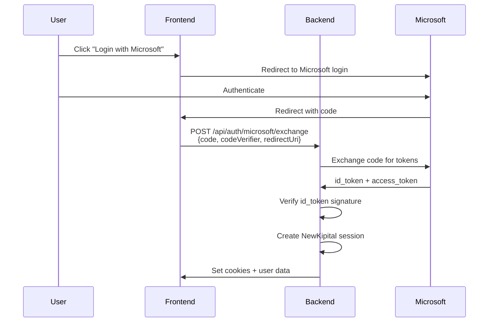
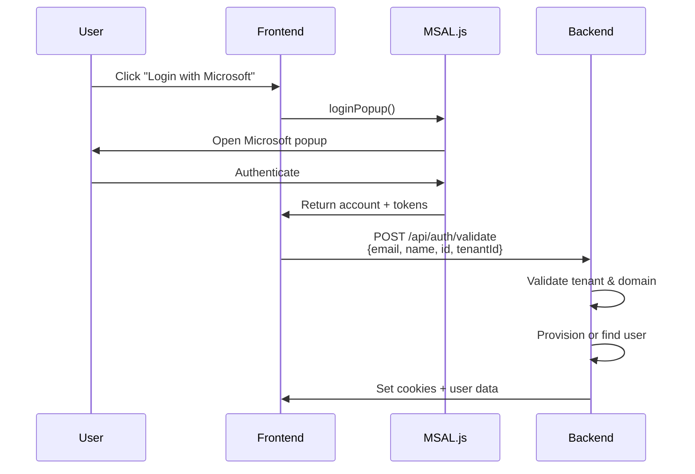

## Overview

NewKipital supports Single Sign-On (SSO) via Microsoft Azure AD (Microsoft Entra ID) using the OAuth 2.0 Authorization Code Flow with PKCE (Proof Key for Code Exchange).

## Authentication Methods

NewKipital provides **two Microsoft SSO flows** to support different frontend architectures:

### 1. Backend-for-Frontend (BFF) Flow

**Endpoint:** `POST /api/auth/microsoft/exchange`

The frontend obtains an authorization code from Microsoft, then exchanges it via the backend:



### 2. Frontend Popup Flow

**Endpoint:** `POST /api/auth/validate`

The frontend validates the token using Microsoft's JavaScript SDK, then sends identity claims to the backend:



## BFF Flow Implementation

### Frontend: Initiate Login

```typescript
import { PublicClientApplication } from '@azure/msal-browser';

const msalConfig = {
  auth: {
    clientId: 'your-client-id',
    authority: 'https://login.microsoftonline.com/your-tenant-id',
    redirectUri: window.location.origin + '/auth/callback',
  },
};

const msalInstance = new PublicClientApplication(msalConfig);

// Generate PKCE challenge
const { codeVerifier, codeChallenge } = await generatePKCE();

// Redirect to Microsoft
const loginRequest = {
  scopes: ['openid', 'profile', 'email'],
  redirectUri: msalConfig.auth.redirectUri,
  codeChallenge,
  codeChallengeMethod: 'S256',
};

await msalInstance.loginRedirect(loginRequest);

// Store codeVerifier in sessionStorage for callback
sessionStorage.setItem('pkce_verifier', codeVerifier);
```

### Frontend: Handle Callback

```typescript
// In /auth/callback route
const urlParams = new URLSearchParams(window.location.search);
const code = urlParams.get('code');
const codeVerifier = sessionStorage.getItem('pkce_verifier');

if (code && codeVerifier) {
  const response = await fetch('/api/auth/microsoft/exchange', {
    method: 'POST',
    headers: { 'Content-Type': 'application/json' },
    body: JSON.stringify({
      code,
      codeVerifier,
      redirectUri: window.location.origin + '/auth/callback',
    }),
    credentials: 'include',  // Important: send cookies
  });

  const data = await response.json();
  // data.user, data.companies

  // Redirect to app
  window.location.href = '/dashboard';
}
```

### Backend: Exchange Code

The backend implementation in `microsoft-auth.service.ts:74`:

```typescript
async exchangeCodeAndValidateIdentity(
  code: string,
  codeVerifier: string,
  redirectUri: string,
): Promise<ValidatedMicrosoftIdentity> {
  // 1. Exchange authorization code for tokens
  const tokenUrl = `https://login.microsoftonline.com/${tenantId}/oauth2/v2.0/token`;
  const body = new URLSearchParams({
    client_id: clientId,
    grant_type: 'authorization_code',
    code,
    redirect_uri: redirectUri,
    code_verifier: codeVerifier,
  });

  const tokenResponse = await fetch(tokenUrl, {
    method: 'POST',
    headers: { 'Content-Type': 'application/x-www-form-urlencoded' },
    body,
  });

  const tokenPayload = await tokenResponse.json();

  // 2. Verify id_token signature
  const claims = await this.verifyMicrosoftIdToken(
    tokenPayload.id_token,
    clientId,
    tenantId,
  );

  // 3. Validate allowed domain
  const domain = claims.preferred_username.split('@')[1];
  this.validateAllowedDomain(domain);

  return {
    tenantId,
    objectId: claims.oid,
    login: claims.preferred_username.toLowerCase(),
    emailDomain: domain,
    accessToken: tokenPayload.access_token,
  };
}
```

## Popup Flow Implementation

### Frontend: MSAL Popup

```typescript
import { PublicClientApplication } from '@azure/msal-browser';

const msalInstance = new PublicClientApplication({
  auth: {
    clientId: 'your-client-id',
    authority: 'https://login.microsoftonline.com/your-tenant-id',
  },
});

const loginRequest = {
  scopes: ['openid', 'profile', 'email', 'User.Read'],
};

try {
  const response = await msalInstance.loginPopup(loginRequest);
  
  // Send identity to backend
  const apiResponse = await fetch('/api/auth/validate', {
    method: 'POST',
    headers: { 'Content-Type': 'application/json' },
    body: JSON.stringify({
      email: response.account.username,
      name: response.account.name,
      id: response.account.localAccountId,  // oid
      tenantId: response.account.tenantId,
      accessToken: response.accessToken,  // optional
    }),
    credentials: 'include',
  });

  const data = await apiResponse.json();
  // data.data.usuario, data.message
} catch (error) {
  console.error('Microsoft login failed:', error);
}
```

### Backend: Validate Identity

The backend implementation in `auth.controller.ts:200`:

```typescript
@Post('validate')
async validateMicrosoft(
  @Body() dto: ValidateMicrosoftDto,
  @Req() req: Request,
  @Res({ passthrough: true }) res: Response,
) {
  // 1. Validate tenant ID
  const allowedTenant = this.config.get('MICROSOFT_TENANT_ID');
  if (allowedTenant && dto.tenantId !== allowedTenant) {
    throw new UnauthorizedException(
      'Acceso denegado: tenant Microsoft no autorizado'
    );
  }

  // 2. Validate email domain
  const allowedDomains = this.config
    .get('MICROSOFT_ALLOWED_DOMAINS', '')
    .split(',')
    .map(d => d.trim().toLowerCase())
    .filter(Boolean);
  
  const emailDomain = dto.email.split('@')[1]?.toLowerCase();
  if (allowedDomains.length > 0 && !allowedDomains.includes(emailDomain)) {
    throw new ForbiddenException(
      'Acceso denegado: dominio de correo no permitido'
    );
  }

  // 3. Find or provision user
  const issued = await this.authService.loginWithMicrosoftValidatedUser(
    dto.id,
    dto.tenantId,
    dto.email,
    ip,
    req.headers['user-agent'],
  );

  // 4. Set session cookies
  this.setSessionCookies(
    res,
    issued.accessToken,
    issued.refreshToken,
    issued.csrfToken,
  );

  return { success: true, data: { usuario: ... } };
}
```

## ID Token Verification

The backend **cryptographically verifies** Microsoft id_token signatures using RSA-SHA256:

```typescript
private async verifyMicrosoftIdToken(
  idToken: string,
  expectedAudience: string,
  expectedTenantId: string,
): Promise<MicrosoftIdTokenClaims> {
  const [encodedHeader, encodedPayload, encodedSignature] = idToken.split('.');
  
  const header = this.parseBase64Json<MicrosoftJwtHeader>(encodedHeader);
  const claims = this.parseBase64Json<MicrosoftIdTokenClaims>(encodedPayload);

  // 1. Validate algorithm
  if (header.alg !== 'RS256') {
    throw new UnauthorizedException('Algoritmo no permitido');
  }

  // 2. Validate claims
  const now = Math.floor(Date.now() / 1000);
  if (claims.exp <= now) {
    throw new UnauthorizedException('Token expirado');
  }
  if (claims.aud !== expectedAudience) {
    throw new UnauthorizedException('Audience invalida');
  }
  if (claims.tid !== expectedTenantId) {
    throw new UnauthorizedException('Tenant invalido');
  }

  const validIssuers = new Set([
    `https://login.microsoftonline.com/${expectedTenantId}/v2.0`,
    `https://sts.windows.net/${expectedTenantId}/`,
  ]);
  if (!validIssuers.has(claims.iss)) {
    throw new UnauthorizedException('Issuer invalido');
  }

  // 3. Fetch JWKS and verify signature
  const jwks = await this.getJwks(expectedTenantId);
  const jwk = jwks.find(k => k.kid === header.kid && k.kty === 'RSA');
  if (!jwk) {
    throw new UnauthorizedException('Llave publica no encontrada');
  }

  const verifier = createVerify('RSA-SHA256');
  verifier.update(`${encodedHeader}.${encodedPayload}`);
  verifier.end();

  const publicKey = createPublicKey({ key: jwk as any, format: 'jwk' });
  const signature = this.base64UrlDecodeToBuffer(encodedSignature);
  const isValid = verifier.verify(publicKey, signature);

  if (!isValid) {
    throw new UnauthorizedException('Firma invalida');
  }

  return claims;
}
```

<Info>
JWKS (JSON Web Key Set) is fetched from Microsoft and **cached for 10 minutes** to reduce latency and API calls.
</Info>

## Tenant & Domain Restrictions

NewKipital enforces **tenant and domain restrictions** to prevent unauthorized access:

### Tenant Validation

```typescript
// Environment configuration
MICROSOFT_TENANT_ID=8a1b2c3d-4e5f-6a7b-8c9d-0e1f2a3b4c5d

// Only users from this specific Azure AD tenant can authenticate
```

### Domain Validation

```typescript
// Environment configuration
MICROSOFT_ALLOWED_DOMAINS=kpital360.com,partner.com

// Only users with @kpital360.com or @partner.com emails can authenticate
```

Validation occurs at `auth.controller.ts:219` for the `/validate` flow and `microsoft-auth.service.ts:143` for the `/exchange` flow.

<Warning>
If `MICROSOFT_ALLOWED_DOMAINS` is empty or not set, **any domain** from the configured tenant will be accepted. Always configure this in production.
</Warning>

## User Provisioning

NewKipital supports **automatic user provisioning** and **identity binding**:

### First-time Login (Exchange Flow)

```typescript
async loginWithMicrosoftIdentity(
  microsoftOid: string,
  microsoftTid: string,
  ip?: string,
  userAgent?: string,
): Promise<IssuedSession> {
  const user = await this.usersService.findByMicrosoftIdentity(
    microsoftOid,
    microsoftTid,
  );
  
  if (!user) {
    throw new ForbiddenException(
      'Su cuenta Microsoft no esta aprovisionada en KPITAL'
    );
  }

  await this.usersService.registerSuccessfulLogin(user.id, ip);
  return this.issueSessionTokens(user, ip, userAgent);
}
```

<Warning>
The `/exchange` flow **requires pre-provisioned users**. Users must exist in `sys_usuarios` with matching `microsoftOid` and `microsoftTid` before they can log in.
</Warning>

### First-time Login (Validate Flow)

```typescript
async loginWithMicrosoftValidatedUser(
  microsoftOid: string,
  microsoftTid: string,
  email: string,
  ip?: string,
  userAgent?: string,
): Promise<IssuedSession> {
  let user = await this.usersService.findByMicrosoftIdentity(
    microsoftOid,
    microsoftTid,
  );

  if (!user) {
    // Try to find by email
    user = await this.usersService.findByEmail(email);
    
    if (!user) {
      throw new ForbiddenException(
        'Acceso denegado: la cuenta Microsoft no existe en KPITAL. '
        + 'Solicite aprovisionamiento a TI/RRHH.'
      );
    }

    // Bind Microsoft identity to existing user
    if (!user.microsoftOid || !user.microsoftTid) {
      await this.usersService.bindMicrosoftIdentity(
        user.id,
        microsoftOid,
        microsoftTid,
      );
      user = await this.usersService.findByEmail(email);
    }
  }

  await this.usersService.registerSuccessfulLogin(user.id, ip);
  return this.issueSessionTokens(user, ip, userAgent);
}
```

<Info>
The `/validate` flow supports **automatic identity binding**. If a user exists with the email but no Microsoft identity, the system will link the Microsoft Object ID and Tenant ID.
</Info>

## Azure AD Configuration

### 1. Register Application

1. Go to [Azure Portal](https://portal.azure.com)
2. Navigate to **Azure Active Directory** > **App registrations**
3. Click **New registration**
4. Configure:
   - **Name:** NewKipital Production
   - **Supported account types:** Single tenant
   - **Redirect URI:** Web - `https://app.kpital360.com/auth/callback`

### 2. Configure Authentication

- **Platform:** Single-page application (SPA)
- **Redirect URIs:**
  - `https://app.kpital360.com/auth/callback`
  - `http://localhost:3000/auth/callback` (development)
- **Implicit grant:** ID tokens (for popup flow)
- **Allow public client flows:** No

### 3. API Permissions

- **Microsoft Graph:**
  - `openid` (delegated)
  - `profile` (delegated)
  - `email` (delegated)
  - `User.Read` (delegated)

### 4. Generate Client Secret

1. Go to **Certificates & secrets**
2. Click **New client secret**
3. Add description and expiration
4. Copy the **Value** (not the Secret ID)

<Warning>
Client secrets expire. Set a calendar reminder to rotate before expiration to prevent service interruption.
</Warning>

### 5. Copy Configuration

- **Application (client) ID** → `MICROSOFT_CLIENT_ID`
- **Directory (tenant) ID** → `MICROSOFT_TENANT_ID`
- **Client secret value** → `MICROSOFT_CLIENT_SECRET`

## Environment Variables

```bash
# Required
MICROSOFT_CLIENT_ID=12345678-abcd-1234-abcd-123456789abc
MICROSOFT_TENANT_ID=87654321-dcba-4321-dcba-987654321fed
MICROSOFT_REDIRECT_URI=https://app.kpital360.com/auth/callback

# Optional (recommended for production)
MICROSOFT_CLIENT_SECRET=your-client-secret-value
MICROSOFT_ALLOWED_DOMAINS=kpital360.com,trusted-partner.com
```

## Rate Limiting

Microsoft SSO endpoints are rate limited:

```typescript
// /api/auth/microsoft/exchange
await rateLimit.consume(`microsoft-exchange:${ip}`, 10, 60_000);

// /api/auth/validate
await rateLimit.consume(`microsoft-validate:${ip}`, 10, 60_000);
```

**Limit:** 10 requests per minute per IP address

## Error Handling

### Common Errors

<AccordionGroup>
  <Accordion title="Invalid tenant">
    **Error:** `Acceso denegado: tenant Microsoft no autorizado para este ambiente`

    **Cause:** User's tenant ID doesn't match `MICROSOFT_TENANT_ID`

    **Solution:** Verify user is logging in with correct organizational account
  </Accordion>

  <Accordion title="Domain not allowed">
    **Error:** `Acceso denegado: dominio de correo no permitido`

    **Cause:** User's email domain not in `MICROSOFT_ALLOWED_DOMAINS`

    **Solution:** Add domain to allowed list or verify user is using correct email
  </Accordion>

  <Accordion title="User not provisioned">
    **Error:** `Su cuenta Microsoft no esta aprovisionada en KPITAL`

    **Cause:** User doesn't exist in `sys_usuarios` or Microsoft identity not linked

    **Solution:** Create user account or use `/validate` flow for auto-linking
  </Accordion>

  <Accordion title="Token signature invalid">
    **Error:** `Firma de token Microsoft invalida`

    **Cause:** Token tampered with or JWKS cache stale

    **Solution:** Verify client ID matches Azure app registration, check system clock
  </Accordion>
</AccordionGroup>

## Audit Events

Microsoft SSO authentication is fully audited:

```typescript
// Successful authentication
{
  event: 'login_success',
  outcome: 'success',
  userId: 123,
  email: 'user@kpital360.com',
  ip: '192.168.1.1',
  metadata: { provider: 'microsoft_exchange' }
}

// Failed authentication
{
  event: 'microsoft_exchange_failed',
  outcome: 'failed',
  email: 'user@untrusted.com',
  ip: '192.168.1.1',
  reason: 'domain_not_allowed'
}
```

Events are persisted to `sys_domain_events` table.

## Security Considerations

<Warning>
**Production Checklist:**

- Set `MICROSOFT_ALLOWED_DOMAINS` to restrict email domains
- Use `MICROSOFT_CLIENT_SECRET` for confidential client flow
- Configure `MICROSOFT_TENANT_ID` to single tenant
- Enable HTTPS and set `secure: true` on cookies
- Rotate client secrets before expiration
- Monitor audit logs for unauthorized access attempts
</Warning>

## Next Steps

<CardGroup cols={2}>
  <Card title="Session Management" icon="clock-rotate-left" href="/auth/session-management">
    Learn about token refresh and rotation
  </Card>
  <Card title="CSRF Protection" icon="shield-halved" href="/auth/csrf-protection">
    Understand state-changing request protection
  </Card>
</CardGroup>