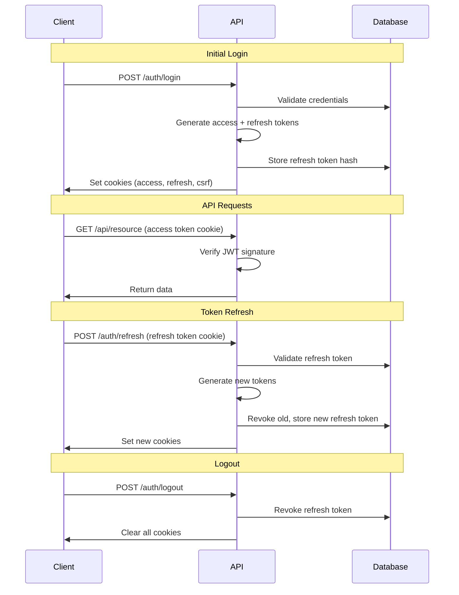

## Overview

NewKipital uses a **dual-token session system** for secure, stateless authentication:

- **Access Token** - Short-lived JWT for API requests (8 hours)
- **Refresh Token** - Long-lived token for session renewal (30 days)
- **CSRF Token** - Random UUID for state-changing operations

All tokens are delivered via **httpOnly cookies** to prevent XSS attacks.

## Token Lifecycle



## Access Tokens

### Structure

Access tokens are standard JWTs with minimal claims:

```json
{
  "sub": 123,
  "email": "user@kpital360.com",
  "type": "access",
  "iat": 1709577600,
  "exp": 1709606400
}
```

**Claims:**
- `sub` - Subject (user ID)
- `email` - User email address
- `type` - Token type discriminator
- `iat` - Issued at (Unix timestamp)
- `exp` - Expires at (Unix timestamp)

### Generation

Access tokens are signed using HS256 (HMAC-SHA256):

```typescript
private signAccessToken(user: User): string {
  const payload: Pick<TokenPayload, 'sub' | 'email' | 'type'> = {
    sub: user.id,
    email: user.email,
    type: 'access',
  };

  return this.jwtService.sign(payload);
}
```

See `auth.service.ts:590`

### Expiration

Access tokens expire after **8 hours** by default. Configure via:

```bash
JWT_EXPIRATION=8h  # Supports: s (seconds), m (minutes), h (hours), d (days)
```

<Info>
Access tokens are **stateless**. The server does not track them in the database, making validation extremely fast.
</Info>

### Verification

Access tokens are verified by the `JwtAuthGuard` using Passport.js:

```typescript
@Injectable()
export class JwtStrategy extends PassportStrategy(Strategy) {
  constructor(config: ConfigService) {
    super({
      jwtFromRequest: ExtractJwt.fromExtractors([
        (req) => req?.cookies?.platform_token,
      ]),
      ignoreExpiration: false,
      secretOrKey: config.getOrThrow<string>('JWT_SECRET'),
    });
  }

  async validate(payload: TokenPayload) {
    if (payload.type !== 'access') {
      throw new UnauthorizedException('Invalid token type');
    }
    return { userId: payload.sub, email: payload.email };
  }
}
```

### Cookie Configuration

Access tokens are stored in `platform_token` cookie:

```typescript
// Production
{
  name: 'platform_token',
  httpOnly: true,
  secure: true,
  sameSite: 'none',
  domain: '.kpital360.com',
  path: '/',
  maxAge: 28800000  // 8 hours in milliseconds
}

// Development
{
  name: 'platform_token',
  httpOnly: true,
  secure: false,
  sameSite: 'lax',
  domain: undefined,
  path: '/',
  maxAge: 28800000
}
```

See `cookie.config.ts:14`

## Refresh Tokens

### Structure

Refresh tokens include additional claims for rotation tracking:

```json
{
  "sub": 123,
  "email": "user@kpital360.com",
  "type": "refresh",
  "jti": "a1b2c3d4-e5f6-4789-a012-3456789abcde",
  "iat": 1709577600,
  "exp": 1712169600
}
```

**Claims:**
- `sub` - Subject (user ID)
- `email` - User email address
- `type` - Token type discriminator
- `jti` - JWT ID (random UUID for tracking)
- `iat` - Issued at (Unix timestamp)
- `exp` - Expires at (Unix timestamp)

### Generation

Refresh tokens are signed with extended expiration:

```typescript
private signRefreshToken(user: User, jti: string): string {
  const payload: Pick<TokenPayload, 'sub' | 'email' | 'type' | 'jti'> = {
    sub: user.id,
    email: user.email,
    type: 'refresh',
    jti,
  };

  const expiresIn = this.config.get<string>(
    'JWT_REFRESH_EXPIRATION',
    '30d',
  );

  return this.jwtService.sign(payload, { expiresIn });
}
```

See `auth.service.ts:600`

### Expiration

Refresh tokens expire after **30 days** by default. Configure via:

```bash
JWT_REFRESH_EXPIRATION=30d
```

### Persistence

Refresh tokens are **hashed and stored** in the database:

```typescript
private async persistRefreshSession(
  userId: number,
  jti: string,
  refreshToken: string,
  ip?: string,
  userAgent?: string,
): Promise<void> {
  const tokenHash = await bcrypt.hash(refreshToken, 10);
  const expiresAt = new Date(
    Date.now() + this.parseDurationToMs(
      this.config.get('JWT_REFRESH_EXPIRATION', '30d')
    )
  );

  const session = this.refreshSessionRepo.create({
    jti,
    userId,
    tokenHash,
    expiresAt,
    createdIp: ip ?? null,
    createdUa: userAgent?.slice(0, 255) ?? null,
  });

  await this.refreshSessionRepo.save(session);
}
```

See `auth.service.ts:628`

**Database Schema:**

```sql
CREATE TABLE sys_refresh_sessions (
  id_refresh_session INT PRIMARY KEY AUTO_INCREMENT,
  jti_refresh_session VARCHAR(64) UNIQUE NOT NULL,
  id_usuario INT NOT NULL,
  token_hash_refresh_session VARCHAR(255) NOT NULL,
  expires_at_refresh_session DATETIME NOT NULL,
  rotated_at_refresh_session DATETIME NULL,
  revoked_at_refresh_session DATETIME NULL,
  replaced_by_jti_refresh_session VARCHAR(64) NULL,
  created_ip_refresh_session VARCHAR(45) NULL,
  created_ua_refresh_session VARCHAR(255) NULL,
  fecha_creacion_refresh_session DATETIME DEFAULT CURRENT_TIMESTAMP,
  fecha_modificacion_refresh_session DATETIME ON UPDATE CURRENT_TIMESTAMP,
  INDEX IDX_refresh_session_user (id_usuario),
  INDEX IDX_refresh_session_jti (jti_refresh_session)
);
```

<Warning>
Refresh tokens are stored as **bcrypt hashes**, not plaintext. This prevents token theft even if the database is compromised.
</Warning>

### Cookie Configuration

Refresh tokens are stored in `platform_refresh_token` cookie:

```typescript
{
  name: 'platform_refresh_token',
  httpOnly: true,
  secure: true,  // production
  sameSite: 'none',  // production
  domain: '.kpital360.com',
  path: '/',
  maxAge: 2592000000  // 30 days in milliseconds
}
```

See `cookie.config.ts:27`

## Token Refresh Flow

### Client Request

The client sends a refresh request with the refresh token cookie:

```typescript
const response = await fetch('/api/auth/refresh', {
  method: 'POST',
  credentials: 'include',  // Send cookies
});

if (response.ok) {
  // New tokens set as cookies automatically
  console.log('Session refreshed');
} else if (response.status === 401) {
  // Refresh token invalid or expired
  window.location.href = '/login';
}
```

### Server Processing

The server validates and rotates tokens:

```typescript
async refreshSession(
  refreshToken: string,
  ip?: string,
  userAgent?: string,
): Promise<IssuedSession> {
  // 1. Verify JWT signature and expiration
  const payload = this.verifyRefreshToken(refreshToken);

  // 2. Find stored session
  const stored = await this.refreshSessionRepo.findOne({
    where: {
      jti: payload.jti,
      userId: payload.sub,
      revokedAt: IsNull(),
      expiresAt: MoreThan(new Date()),
    },
  });

  if (!stored) {
    throw new UnauthorizedException('Refresh token invalido o revocado');
  }

  // 3. Verify token hash (defense against token theft)
  const hashMatches = await bcrypt.compare(refreshToken, stored.tokenHash);
  if (!hashMatches) {
    stored.revokedAt = new Date();
    await this.refreshSessionRepo.save(stored);
    throw new UnauthorizedException('Refresh token invalido o revocado');
  }

  // 4. Get user
  const user = await this.usersService.findByEmail(payload.email);
  if (!user) {
    throw new UnauthorizedException('Sesion invalida');
  }

  // 5. Generate new tokens
  const newJti = randomUUID();
  const newRefreshToken = this.signRefreshToken(user, newJti);
  const accessToken = this.signAccessToken(user);

  // 6. Rotate refresh token
  stored.revokedAt = new Date();
  stored.rotatedAt = new Date();
  stored.replacedByJti = newJti;
  await this.refreshSessionRepo.save(stored);

  // 7. Persist new refresh token
  await this.persistRefreshSession(
    user.id,
    newJti,
    newRefreshToken,
    ip,
    userAgent,
  );

  const session = await this.buildSession(user);

  return {
    accessToken,
    refreshToken: newRefreshToken,
    csrfToken: randomUUID(),
    session,
  };
}
```

See `auth.service.ts:177`

### Automatic Rotation

Every refresh operation **generates new tokens** and **revokes the old refresh token**:

1. Client sends `refreshToken_A`
2. Server validates `refreshToken_A`
3. Server generates `refreshToken_B` and `accessToken_B`
4. Server marks `refreshToken_A` as `revoked` and `rotated`
5. Server stores reference: `refreshToken_A.replacedByJti = refreshToken_B.jti`
6. Client receives `refreshToken_B` and `accessToken_B`

This creates an **audit trail** of token rotation.

<Info>
Token rotation prevents replay attacks. If an attacker steals a refresh token, it becomes invalid after the legitimate user refreshes their session.
</Info>

## CSRF Tokens

CSRF tokens protect state-changing operations. See [CSRF Protection](/auth/csrf-protection) for details.

### Generation

CSRF tokens are random UUIDs generated on login and refresh:

```typescript
import { randomUUID } from 'crypto';

const csrfToken = randomUUID();
// Example: 'a1b2c3d4-e5f6-4789-a012-3456789abcde'
```

### Cookie Configuration

CSRF tokens are stored in `platform_csrf_token` cookie:

```typescript
{
  name: 'platform_csrf_token',
  httpOnly: false,  // JavaScript must read this
  secure: true,
  sameSite: 'none',
  domain: '.kpital360.com',
  path: '/',
  maxAge: 2592000000  // 30 days
}
```

<Warning>
The CSRF cookie is **not httpOnly** because JavaScript needs to read it and include it in request headers.
</Warning>

## Session Building

When tokens are issued, the server builds a complete session object:

```typescript
async buildSession(
  user: User,
  companyId?: number,
  appCode?: string,
  options?: { bypassCache?: boolean },
): Promise<SessionData> {
  const enabledApps = await this.getEnabledApps(user.id);
  const companies = await this.getUserCompanies(user.id);

  let permissions: string[] = [];
  let roles: string[] = [];

  if (companyId && appCode) {
    const resolved = await this.resolvePermissions(
      user.id,
      companyId,
      appCode,
      options,
    );
    permissions = resolved.permissions;
    roles = resolved.roles;
  } else if (appCode) {
    const resolved = await this.resolvePermissionsAcrossCompanies(
      user.id,
      appCode,
      options,
    );
    permissions = resolved.permissions;
    roles = resolved.roles;
  }

  return {
    user: {
      id: user.id,
      email: user.email,
      nombre: user.nombre,
      apellido: user.apellido,
      avatarUrl: user.avatarUrl,
    },
    enabledApps,
    companies,
    permissions,
    roles,
  };
}
```

See `auth.service.ts:272`

**Returned to Client:**

```json
{
  "user": {
    "id": "123",
    "email": "user@kpital360.com",
    "name": "Juan Pérez",
    "avatarUrl": null,
    "roles": ["admin", "finance_user"],
    "enabledApps": ["kpital", "treasury"],
    "companyIds": ["1", "2"]
  },
  "companies": [
    {
      "id": 1,
      "nombre": "KPITAL S.A.",
      "codigo": "KPITAL"
    }
  ]
}
```

## Logout

### Client Request

```typescript
const response = await fetch('/api/auth/logout', {
  method: 'POST',
  headers: {
    'x-csrf-token': getCsrfToken(),  // From cookie
  },
  credentials: 'include',
});

if (response.ok) {
  window.location.href = '/login';
}
```

### Server Processing

```typescript
@Post('logout')
async logout(
  @Req() req: Request,
  @Res({ passthrough: true }) res: Response
) {
  // 1. Revoke refresh token
  await this.authService.revokeRefreshToken(
    req.cookies?.[REFRESH_COOKIE_NAME],
  );

  // 2. Clear all cookies
  res.clearCookie(COOKIE_NAME, getClearCookieOptions(this.config));
  res.clearCookie(
    REFRESH_COOKIE_NAME,
    getClearRefreshCookieOptions(this.config),
  );
  res.clearCookie(
    CSRF_COOKIE_NAME,
    getClearCsrfCookieOptions(this.config),
  );

  // 3. Audit log
  await this.audit.record({
    event: 'logout',
    outcome: 'success',
    userId: (req as any).user?.userId ?? null,
    ip: (req.headers['x-forwarded-for'] as string)?.split(',')[0] || req.ip,
  });

  return { message: 'Sesion cerrada' };
}
```

See `auth.controller.ts:414`

### Token Revocation

```typescript
async revokeRefreshToken(refreshToken?: string): Promise<void> {
  if (!refreshToken) return;

  try {
    const payload = this.verifyRefreshToken(refreshToken);
    await this.refreshSessionRepo.update(
      {
        jti: payload.jti,
        userId: payload.sub,
        revokedAt: IsNull(),
      },
      {
        revokedAt: new Date(),
      },
    );
  } catch {
    // Token invalid or expired, ignore
  }
}
```

See `auth.service.ts:252`

## Rate Limiting

Session endpoints are rate limited per IP address:

```typescript
// Login: 5 requests per minute
await rateLimit.consume(`login:${ip}`, 5, 60_000);

// Refresh: 10 requests per minute
await rateLimit.consume(`refresh:${ip}`, 10, 60_000);
```

Exceeding the limit returns HTTP 429:

```json
{
  "statusCode": 429,
  "message": "Demasiados intentos. Intente nuevamente en unos minutos."
}
```

## Environment Variables

```bash
# JWT Configuration
JWT_SECRET=your-secret-key-min-32-chars-long
JWT_EXPIRATION=8h
JWT_REFRESH_EXPIRATION=30d

# Environment
NODE_ENV=production  # or 'development'

# Redis (optional, for distributed rate limiting)
REDIS_HOST=redis.example.com
REDIS_PORT=6379
REDIS_PASSWORD=redis-password
```

<Warning>
**JWT_SECRET must be:**
- At least 32 characters long
- Cryptographically random
- Kept secret and never committed to version control
- Rotated periodically
</Warning>

## Security Best Practices

### Cookie Security

<Accordion title="Use httpOnly cookies">
  Prevents XSS attacks from stealing tokens. JavaScript cannot access httpOnly cookies.
</Accordion>

<Accordion title="Enable secure flag in production">
  Ensures cookies are only sent over HTTPS connections.
</Accordion>

<Accordion title="Set appropriate SameSite">
  - Production: `sameSite: 'none'` with `secure: true` for cross-origin requests
  - Development: `sameSite: 'lax'` for same-site only
</Accordion>

<Accordion title="Scope cookies to domain">
  Production cookies are scoped to `.kpital360.com` to work across subdomains.
</Accordion>

### Token Security

<Accordion title="Keep access tokens short-lived">
  Default 8 hours limits impact of token theft. Shorter is more secure but requires more refreshes.
</Accordion>

<Accordion title="Rotate refresh tokens">
  Every refresh generates new tokens and revokes old ones, creating audit trail.
</Accordion>

<Accordion title="Hash refresh tokens in database">
  Bcrypt hashing prevents token theft from database compromise.
</Accordion>

<Accordion title="Track token metadata">
  Store IP address and User-Agent to detect suspicious activity.
</Accordion>

### Session Security

<Accordion title="Implement rate limiting">
  Prevents brute force and abuse. Use Redis for distributed limiting in production.
</Accordion>

<Accordion title="Audit all authentication events">
  Log logins, refreshes, logouts, and failures to `sys_domain_events`.
</Accordion>

<Accordion title="Validate token type">
  Ensure access tokens aren't used for refresh and vice versa.
</Accordion>

<Accordion title="Handle token expiration gracefully">
  Client should automatically refresh tokens before expiration.
</Accordion>

## Client Implementation Example

### Automatic Token Refresh

```typescript
class AuthClient {
  private refreshPromise: Promise<void> | null = null;

  async fetch(url: string, options: RequestInit = {}) {
    // Include credentials (cookies)
    options.credentials = 'include';

    // Add CSRF token for mutations
    if (['POST', 'PUT', 'PATCH', 'DELETE'].includes(options.method || 'GET')) {
      options.headers = {
        ...options.headers,
        'x-csrf-token': this.getCsrfToken(),
      };
    }

    let response = await fetch(url, options);

    // If 401 and not refresh endpoint, try refreshing
    if (response.status === 401 && !url.includes('/auth/refresh')) {
      await this.refreshSession();
      // Retry original request
      response = await fetch(url, options);
    }

    return response;
  }

  private async refreshSession(): Promise<void> {
    // Deduplicate concurrent refresh requests
    if (this.refreshPromise) {
      return this.refreshPromise;
    }

    this.refreshPromise = fetch('/api/auth/refresh', {
      method: 'POST',
      credentials: 'include',
    }).then(async (response) => {
      if (!response.ok) {
        // Refresh failed, redirect to login
        window.location.href = '/login';
        throw new Error('Session expired');
      }
    }).finally(() => {
      this.refreshPromise = null;
    });

    return this.refreshPromise;
  }

  private getCsrfToken(): string {
    const match = document.cookie.match(/platform_csrf_token=([^;]+)/);
    return match ? match[1] : '';
  }
}

const authClient = new AuthClient();

// Usage
const response = await authClient.fetch('/api/companies', {
  method: 'POST',
  headers: { 'Content-Type': 'application/json' },
  body: JSON.stringify({ nombre: 'New Company' }),
});
```

## Troubleshooting

<AccordionGroup>
  <Accordion title="401 Unauthorized on every request">
    **Causes:**
    - Access token cookie not being sent
    - JWT_SECRET mismatch between environments
    - Token expired

    **Solutions:**
    - Verify `credentials: 'include'` in fetch
    - Check cookie domain matches request domain
    - Verify JWT_SECRET is correct
    - Try refreshing session
  </Accordion>

  <Accordion title="Refresh token invalid or revoked">
    **Causes:**
    - Token already used (rotated)
    - Token expired (>30 days)
    - Database record deleted

    **Solutions:**
    - User must re-authenticate
    - Check `sys_refresh_sessions` table
    - Verify refresh token expiration configuration
  </Accordion>

  <Accordion title="CSRF token mismatch">
    **Causes:**
    - CSRF token not included in header
    - Cookie and header values don't match
    - Token not generated on login

    **Solutions:**
    - Read `platform_csrf_token` cookie
    - Include as `x-csrf-token` header
    - Verify cookie is not httpOnly
  </Accordion>

  <Accordion title="Too many refresh requests">
    **Causes:**
    - Rate limit exceeded (>10/min)
    - Client refreshing on every 401
    - Multiple tabs refreshing simultaneously

    **Solutions:**
    - Implement refresh deduplication
    - Cache refresh promise
    - Use shared state across tabs
  </Accordion>
</AccordionGroup>

## Next Steps

<CardGroup cols={2}>
  <Card title="CSRF Protection" icon="shield-halved" href="/auth/csrf-protection">
    Learn about state-changing operation protection
  </Card>
  <Card title="Authorization" icon="key" href="/authorization/overview">
    Understand role-based access control
  </Card>
</CardGroup>