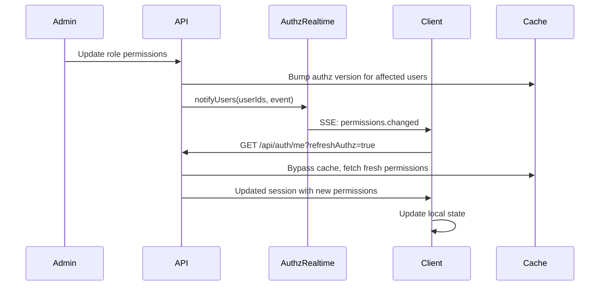

## Overview

NewKipital provides two mechanisms for real-time updates:

1. **WebSocket (Socket.IO)**: Bidirectional communication for notifications and live updates
2. **Server-Sent Events (SSE)**: Unidirectional streaming for permission changes

Both use cookie-based authentication and support automatic reconnection.

<Note>
  WebSocket connections automatically fall back to polling if WebSocket transport is unavailable.
</Note>

## WebSocket Connection

The notification gateway uses Socket.IO for reliable real-time delivery.

### Client Setup

```typescript
import { io, Socket } from 'socket.io-client';

const socket: Socket = io('https://api.kpital360.com', {
  path: '/socket.io',
  transports: ['websocket', 'polling'],
  withCredentials: true, // Required for cookie authentication
  autoConnect: true
});

// Connection established
socket.on('connect', () => {
  console.log('Connected to notification server', socket.id);
});

// Connection error
socket.on('connect_error', (error) => {
  console.error('Connection failed:', error.message);
});

// Server-sent error (e.g., auth failure)
socket.on('error', (data) => {
  console.error('Server error:', data.message);
});

// Disconnection
socket.on('disconnect', (reason) => {
  console.log('Disconnected:', reason);
  // Socket.IO automatically reconnects unless disconnect was manual
});
```

### Configuration

<ParamField path="path" type="string" default="/socket.io">
  The server path for Socket.IO connections
</ParamField>

<ParamField path="transports" type="string[]" default="['websocket', 'polling']">
  Available transport methods. Tries WebSocket first, falls back to polling
</ParamField>

<ParamField path="withCredentials" type="boolean" default="false" required>
  Must be `true` to send authentication cookies with the connection
</ParamField>

<ParamField path="autoConnect" type="boolean" default="true">
  Whether to automatically connect on instantiation
</ParamField>

<Warning>
  **Authentication Required**: The server validates the JWT from the session cookie. Ensure the user is logged in before connecting.
</Warning>

## WebSocket Authentication

Authentication happens during the connection handshake:

1. Client sends connection request with cookies
2. Server extracts JWT from the cookie header
3. JWT is verified using the secret key
4. User ID is extracted from the token payload (`sub` claim)
5. Socket joins a user-specific room: `user:{userId}`

```typescript
// Server-side authentication flow (NotificationsGateway)
async handleConnection(client: Socket) {
  // Extract JWT from cookie header
  const cookies = parseCookie(client.handshake.headers.cookie);
  const token = cookies['kpital_session'];
  
  if (!token) {
    client.emit('error', { message: 'No autorizado' });
    return;
  }
  
  try {
    // Verify JWT and extract user ID
    const payload = this.jwt.verify(token);
    const userId = Number(payload.sub);
    
    // Join user-specific room for targeted messaging
    const room = `user:${userId}`;
    client.join(room);
  } catch {
    client.emit('error', { message: 'Token inválido o expirado' });
  }
}
```

<Info>
  The gateway is defined in `src/modules/notifications/notifications.gateway.ts:1`
</Info>

### Allowed Origins

CORS is configured to allow connections from:

**Development**: 
- `http://localhost:5173`
- `http://localhost:5174`

**Production**:
- `https://kpital360.com`
- `https://timewise.kpital360.com`

Configure via `SOCKET_ALLOWED_ORIGINS` environment variable (comma-separated).

## Notification Events

The gateway emits three types of notification events:

### notification:new

Emitted when a new notification is created for the user.

```typescript
socket.on('notification:new', (data) => {
  console.log('New notification:', data.idNotificacion);
  
  // Fetch full notification details
  fetchNotificationDetails(data.idNotificacion);
  
  // Update UI (show badge, play sound, etc.)
  incrementNotificationBadge();
});
```

**Event Data:**
```json
{
  "idNotificacion": 1234
}
```

<Note>
  The event only contains the notification ID. Fetch complete details via `GET /api/notifications`.
</Note>

### notification:count-update

Emitted when the unread count changes (notification read, deleted, or new).

```typescript
socket.on('notification:count-update', async () => {
  // Refresh unread count from API
  const response = await fetch('/api/notifications/unread-count', {
    credentials: 'include'
  });
  const { count } = await response.json();
  
  // Update UI badge
  updateNotificationBadge(count);
});
```

### notification:list-update

Emitted when the notification list structure changes (notification deleted).

```typescript
socket.on('notification:list-update', async () => {
  // Refresh the entire notification list
  const response = await fetch('/api/notifications', {
    credentials: 'include'
  });
  const notifications = await response.json();
  
  // Update UI list
  renderNotificationList(notifications);
});
```

## Complete Notification Example

Here's a full implementation of notification handling:

```typescript
import { io, Socket } from 'socket.io-client';
import { useEffect, useState } from 'react';

interface Notification {
  id: number;
  idNotificacion: number;
  tipo: string;
  titulo: string;
  mensaje: string | null;
  estado: 'UNREAD' | 'READ' | 'DELETED';
  fechaEntregada: string;
}

export function useNotifications() {
  const [socket, setSocket] = useState<Socket | null>(null);
  const [notifications, setNotifications] = useState<Notification[]>([]);
  const [unreadCount, setUnreadCount] = useState(0);
  const [connected, setConnected] = useState(false);

  useEffect(() => {
    // Initialize Socket.IO connection
    const newSocket = io(import.meta.env.VITE_API_URL, {
      path: '/socket.io',
      transports: ['websocket', 'polling'],
      withCredentials: true
    });

    newSocket.on('connect', () => {
      console.log('Notification socket connected');
      setConnected(true);
      
      // Load initial data
      fetchNotifications();
      fetchUnreadCount();
    });

    newSocket.on('disconnect', () => {
      console.log('Notification socket disconnected');
      setConnected(false);
    });

    newSocket.on('error', (data) => {
      console.error('Socket error:', data.message);
    });

    // Listen for new notifications
    newSocket.on('notification:new', (data) => {
      console.log('New notification received:', data.idNotificacion);
      
      // Refresh list and count
      fetchNotifications();
      fetchUnreadCount();
      
      // Optional: Show browser notification
      if ('Notification' in window && Notification.permission === 'granted') {
        new Notification('Nueva notificación', {
          body: 'Tienes una nueva actualización',
          icon: '/logo.png'
        });
      }
    });

    // Listen for count updates
    newSocket.on('notification:count-update', () => {
      fetchUnreadCount();
    });

    // Listen for list updates
    newSocket.on('notification:list-update', () => {
      fetchNotifications();
    });

    setSocket(newSocket);

    return () => {
      newSocket.close();
    };
  }, []);

  const fetchNotifications = async () => {
    try {
      const response = await fetch('/api/notifications?status=unread', {
        credentials: 'include'
      });
      const data = await response.json();
      setNotifications(data);
    } catch (error) {
      console.error('Failed to fetch notifications:', error);
    }
  };

  const fetchUnreadCount = async () => {
    try {
      const response = await fetch('/api/notifications/unread-count', {
        credentials: 'include'
      });
      const { count } = await response.json();
      setUnreadCount(count);
    } catch (error) {
      console.error('Failed to fetch unread count:', error);
    }
  };

  const markAsRead = async (notificationId: number) => {
    try {
      await fetch(`/api/notifications/${notificationId}/read`, {
        method: 'POST',
        credentials: 'include'
      });
      // Count update event will be received via socket
    } catch (error) {
      console.error('Failed to mark notification as read:', error);
    }
  };

  return {
    socket,
    connected,
    notifications,
    unreadCount,
    markAsRead,
    refresh: fetchNotifications
  };
}
```

## Server-Sent Events (SSE)

SSE is used for streaming permission changes to clients. When a user's permissions are modified (role assigned, permissions changed), they receive a real-time notification to refresh their authorization data.

### Connecting to Permission Stream

```typescript
const userId = getCurrentUserId();
const eventSource = new EventSource(
  '/api/auth/permissions-stream',
  { withCredentials: true }
);

// Connection established
eventSource.addEventListener('connected', (event) => {
  const data = JSON.parse(event.data);
  console.log('Permissions stream connected:', data.at);
});

// Permission change notification
eventSource.addEventListener('permissions.changed', async (event) => {
  const data = JSON.parse(event.data);
  console.log('Permissions changed:', data);
  
  // Refresh user session to get updated permissions
  await refreshUserSession();
  
  // Optional: Show UI notification
  showToast('Tus permisos han sido actualizados', 'info');
});

// Connection error
eventSource.onerror = (error) => {
  console.error('SSE connection error:', error);
  // EventSource automatically reconnects
};

// Clean up on unmount
const cleanup = () => {
  eventSource.close();
};
```

<Info>
  The SSE endpoint is defined in `src/modules/auth/auth.controller.ts:517`
</Info>

### Permission Change Event

**Event:** `permissions.changed`

**Payload:**
```typescript
interface AuthzRealtimeEventPayload {
  type: 'permissions.changed';
  reason: string;           // Description of what changed
  roleId?: number;          // Role ID if related to role changes
  at: string;               // ISO timestamp
}
```

**Example:**
```json
{
  "type": "permissions.changed",
  "reason": "Role permissions updated",
  "roleId": 7,
  "at": "2026-03-04T15:20:00Z"
}
```

### When Permissions Changed Events Are Sent

The `AuthzRealtimeService` notifies users when:

1. **Role permissions are modified**: Users with that role get notified
2. **User is assigned a new role**: The user gets notified
3. **User's role is removed**: The user gets notified
4. **App/Company permissions change**: Affected users get notified

Example from `RolesService`:

```typescript
// After updating role permissions
const affectedUserIds = await this.getAffectedUserIds(roleId);

this.authzRealtime.notifyUsers(affectedUserIds, {
  type: 'permissions.changed',
  reason: 'Role permissions updated',
  roleId,
  at: new Date().toISOString()
});

// Invalidate cached permissions
await this.authzVersionService.bumpVersion(affectedUserIds);
```

<Info>
  See `src/modules/authz/authz-realtime.service.ts:1` for the complete implementation
</Info>

### SSE Keep-Alive

The server sends ping comments every 20 seconds to keep connections alive:

```
: ping\n\n
```

Clients don't need to handle these; they prevent proxy/firewall timeouts.

## Permission Sync Workflow

Here's the complete flow when permissions change:



### Implementing Permission Refresh

```typescript
import { useEffect, useState } from 'react';

interface Session {
  user: User;
  permissions: string[];
  roles: Role[];
}

export function usePermissionSync() {
  const [session, setSession] = useState<Session | null>(null);

  useEffect(() => {
    // Connect to permission stream
    const eventSource = new EventSource('/api/auth/permissions-stream', {
      withCredentials: true
    });

    eventSource.addEventListener('connected', (event) => {
      console.log('Permission sync active');
    });

    eventSource.addEventListener('permissions.changed', async (event) => {
      const data = JSON.parse(event.data);
      console.log('Permissions changed:', data.reason);

      try {
        // Refresh session with cache bypass
        const response = await fetch('/api/auth/me?refreshAuthz=true', {
          credentials: 'include'
        });
        
        if (response.ok) {
          const newSession = await response.json();
          setSession(newSession);
          
          // Optional: Notify user
          toast.info('Tus permisos han sido actualizados');
          
          // Optional: Reload current page if needed
          if (requiresReload(session, newSession)) {
            window.location.reload();
          }
        }
      } catch (error) {
        console.error('Failed to refresh permissions:', error);
      }
    });

    eventSource.onerror = (error) => {
      console.error('Permission stream error:', error);
    };

    return () => {
      eventSource.close();
    };
  }, []);

  return { session };
}

function requiresReload(oldSession: Session, newSession: Session): boolean {
  // Check if critical permissions changed
  const oldPerms = new Set(oldSession.permissions);
  const newPerms = new Set(newSession.permissions);
  
  // If user lost critical permissions, reload
  const criticalPerms = ['admin', 'payroll.apply', 'users.manage'];
  for (const perm of criticalPerms) {
    if (oldPerms.has(perm) && !newPerms.has(perm)) {
      return true;
    }
  }
  
  return false;
}
```

## Authz Token (Alternative to SSE)

For clients that can't use SSE, the system provides a token-based alternative:

```typescript
// Get current authz token
const response = await fetch('/api/auth/authz-token', {
  credentials: 'include'
});
const { token, serverTime } = await response.json();

// Store token locally
localStorage.setItem('authz_token', token);

// Periodically check if token changed
setInterval(async () => {
  const response = await fetch('/api/auth/authz-token', {
    credentials: 'include'
  });
  const { token: newToken } = await response.json();
  
  const oldToken = localStorage.getItem('authz_token');
  if (newToken !== oldToken) {
    console.log('Authorization changed, refreshing...');
    localStorage.setItem('authz_token', newToken);
    
    // Refresh session
    await refreshUserSession();
  }
}, 30000); // Check every 30 seconds
```

<Warning>
  Polling is less efficient than SSE. Use SSE when possible for immediate updates.
</Warning>

## Connection Management

### Reconnection Strategy

Both Socket.IO and EventSource automatically handle reconnection:

**Socket.IO**:
- Reconnects automatically with exponential backoff
- Configurable via `reconnectionDelay` and `reconnectionDelayMax`
- Emits `connect_error` events for failures

**EventSource**:
- Automatically reconnects after 3 seconds
- No manual reconnection needed
- Check `readyState` property: `0` (connecting), `1` (open), `2` (closed)

### Cleanup on Logout

```typescript
function logout() {
  // Close WebSocket connection
  if (socket) {
    socket.close();
  }
  
  // Close SSE connection
  if (permissionStream) {
    permissionStream.close();
  }
  
  // Clear session
  await fetch('/api/auth/logout', {
    method: 'POST',
    credentials: 'include'
  });
  
  // Redirect to login
  window.location.href = '/login';
}
```

## Best Practices

<CardGroup cols={2}>
  <Card title="Connect After Login" icon="right-to-bracket">
    Establish real-time connections only after successful authentication to avoid unnecessary connection errors.
  </Card>
  
  <Card title="Handle Disconnections" icon="plug">
    Display connection status in the UI so users know when real-time updates are unavailable.
  </Card>
  
  <Card title="Debounce Refreshes" icon="clock">
    When receiving multiple rapid events, debounce API calls to avoid overwhelming the server.
  </Card>
  
  <Card title="Fallback to Polling" icon="rotate">
    For critical features, implement polling as a fallback if WebSocket/SSE connections fail.
  </Card>
</CardGroup>

## Troubleshooting

<AccordionGroup>
  <Accordion title="Connection Refused / 401 Error">
    **Cause**: Missing or invalid authentication cookie.
    
    **Solution**: Ensure user is logged in and cookies are enabled. Check that `withCredentials: true` is set on the connection.
  </Accordion>

  <Accordion title="Events Not Received">
    **Cause**: Client not subscribed to events or socket disconnected.
    
    **Solution**: Check `socket.connected` status. Verify event listeners are registered before events are emitted.
  </Accordion>

  <Accordion title="CORS Errors">
    **Cause**: Origin not in allowed list.
    
    **Solution**: Add your frontend URL to `SOCKET_ALLOWED_ORIGINS` environment variable on the server.
  </Accordion>

  <Accordion title="SSE Connection Drops">
    **Cause**: Proxy or firewall timeout.
    
    **Solution**: The server sends keep-alive pings every 20 seconds. If still dropping, reduce keep-alive interval or configure proxy timeouts.
  </Accordion>
</AccordionGroup>

## Related Resources

<CardGroup cols={2}>
  <Card title="Notifications" icon="bell" href="/integration/notifications">
    Learn about the notification system powered by WebSocket
  </Card>
  
  <Card title="Domain Events" icon="diagram-project" href="/integration/events">
    Understand the event-driven architecture
  </Card>
</CardGroup>