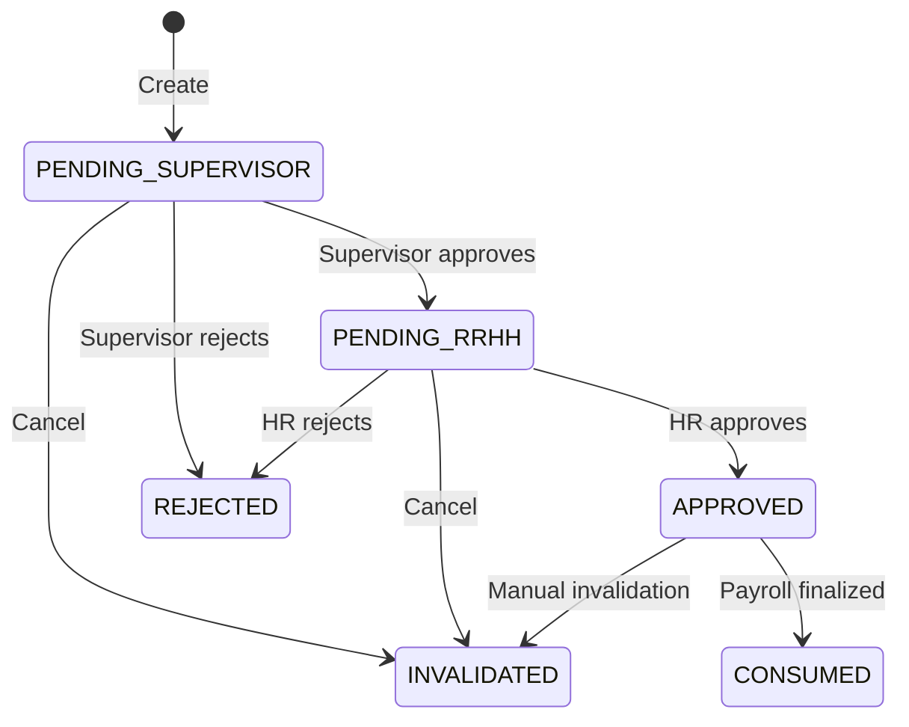

Absences represent days when an employee does not work and may or may not receive pay, depending on whether the absence is justified. The system tracks absence details and automatically calculates the payroll impact.

## Overview

Absence actions (`tipoAccion: 'ausencia'`) enable HR to:
- Record justified absences (sick leave, approved time off)
- Track unjustified absences (unauthorized absence)
- Calculate pay deductions or adjustments
- Associate absences with specific payroll periods
- Span absences across multiple pay cycles

## Absence types

Each absence is classified as one of two types:

<Tabs>
  <Tab title="Justified">
    **Justified absences** (`JUSTIFICADA`) occur when an employee has approval or valid reason for missing work.
    
    Examples:
    - Medical appointments with documentation
    - Approved personal leave
    - Bereavement leave
    - Jury duty
    
    <Info>
    Justified absences may still result in pay deductions, depending on company policy and the payroll movement configuration.
    </Info>
  </Tab>
  
  <Tab title="Unjustified">
    **Unjustified absences** (`NO_JUSTIFICADA`) are unauthorized absences without valid reason or approval.
    
    Examples:
    - No-call, no-show
    - Unapproved absence
    - Excessive tardiness treated as absence
    
    <Warning>
    Unjustified absences typically result in pay deductions and may have additional HR policy implications.
    </Warning>
  </Tab>
</Tabs>

## Creating absences

Absences are created through the `/personal-actions/ausencias` endpoint and must include one or more lines representing individual payroll periods.

### Request structure

```typescript
interface UpsertAbsenceDto {
  idEmpresa: number;        // Company ID
  idEmpleado: number;       // Employee ID
  observacion?: string;     // Optional notes (max 500 chars)
  lines: AbsenceLine[];     // One or more absence lines
}

interface AbsenceLine {
  payrollId: number;           // Target payroll calendar
  fechaEfecto: string;         // Effective date (ISO 8601)
  movimientoId: number;        // Payroll movement ID
  tipoAusencia: 'JUSTIFICADA' | 'NO_JUSTIFICADA';
  cantidad: number;            // Number of absence units (e.g., days)
  monto: number;               // Deduction amount
  remuneracion: boolean;       // Whether this counts as salary
  formula?: string;            // Optional calculation formula
}
```

### Example: Single-period absence

```typescript
POST /personal-actions/ausencias
Content-Type: application/json

{
  "idEmpresa": 1,
  "idEmpleado": 42,
  "observacion": "Sick leave with medical certificate",
  "lines": [
    {
      "payrollId": 100,
      "fechaEfecto": "2026-03-15",
      "movimientoId": 5,
      "tipoAusencia": "JUSTIFICADA",
      "cantidad": 2,
      "monto": 300.00,
      "remuneracion": false,
      "formula": "(salario_base / 30) * cantidad"
    }
  ]
}
```

### Example: Multi-period absence

```typescript
POST /personal-actions/ausencias
Content-Type: application/json

{
  "idEmpresa": 1,
  "idEmpleado": 42,
  "observacion": "Extended medical leave",
  "lines": [
    {
      "payrollId": 100,
      "fechaEfecto": "2026-03-01",
      "movimientoId": 5,
      "tipoAusencia": "JUSTIFICADA",
      "cantidad": 5,
      "monto": 750.00,
      "remuneracion": false
    },
    {
      "payrollId": 101,
      "fechaEfecto": "2026-03-15",
      "movimientoId": 5,
      "tipoAusencia": "JUSTIFICADA",
      "cantidad": 3,
      "monto": 450.00,
      "remuneracion": false
    }
  ]
}
```

<Note>
When an absence spans multiple payroll periods, the system creates one action per payroll but links them with a shared `groupId` for tracking.
</Note>

## Validation rules

The system enforces several validation rules when creating or updating absences:

### Employee validation

<Steps>
  <Step title="Company membership">
    Employee must belong to the specified company.
    
    ```typescript
    // From personal-actions.service.ts:1338
    await this.assertUserCompanyAccess(userId, dto.idEmpresa);
    ```
  </Step>
  
  <Step title="Active status">
    Employee must be in active status with salary information available.
  </Step>
  
  <Step title="Salary currency">
    Employee's salary currency must match the target payroll's currency.
  </Step>
</Steps>

### Payroll validation

Absences can only be associated with eligible payrolls:

```typescript
// Eligible payroll states
EstadoCalendarioNomina.ABIERTA      // Open for changes
EstadoCalendarioNomina.EN_PROCESO   // Processing but not finalized
```

<Warning>
You cannot create absences for payrolls in `APLICADA` (finalized) state. The payroll must be reopened first.
</Warning>

### Line validation

| Field | Validation |
|-------|------------|
| `cantidad` | Must be ≥ 1 |
| `monto` | Must be ≥ 0, max 9,999,999,999.99 |
| `fechaEfecto` | Must be valid ISO 8601 date |
| `movimientoId` | Must reference active payroll movement |
| `tipoAusencia` | Must be `JUSTIFICADA` or `NO_JUSTIFICADA` |

## Approval workflow

Absences follow a multi-stage approval process before affecting payroll.

<Steps>
  <Step title="Draft creation">
    HR creates the absence in `DRAFT` state (1).
    
    ```typescript
    estado: PersonalActionEstado.PENDING_SUPERVISOR
    ```
    
    <Info>
    Actually, absences skip DRAFT and start at `PENDING_SUPERVISOR` (2) for immediate supervisor review.
    </Info>
  </Step>
  
  <Step title="Supervisor approval">
    Direct supervisor reviews the absence.
    
    **Required permission:** `hr-action-ausencias:approve`
    
    ```bash
    PATCH /personal-actions/ausencias/123/advance
    ```
    
    This moves the absence to `PENDING_RRHH` (3).
  </Step>
  
  <Step title="HR approval">
    HR department performs final review.
    
    **Required permission:** `hr-action-ausencias:approve`
    
    ```bash
    PATCH /personal-actions/ausencias/123/advance
    ```
    
    This moves the absence to `APPROVED` (4) and triggers payroll recalculation.
  </Step>
</Steps>

### State transitions



## Payroll integration

Once approved, absences automatically integrate with payroll processing.

### Quota creation

The system creates action quotas (`acc_cuotas_accion`) for each line:

```typescript
// From personal-actions.service.ts:1384
const quota = trx.create(ActionQuota, {
  idAccion: savedAction.id,
  idEmpresa: dto.idEmpresa,
  idEmpleado: dto.idEmpleado,
  idCalendarioNomina: line.payrollId,
  numeroCuota: i + 1,
  montoCuota: Number(line.monto),
  estado: EstadoCuota.PENDIENTE_APROBACION,
  fechaEfecto: new Date(line.fechaEfecto),
  motivoEstado: null,
});
```

### Recalculation trigger

When an absence is approved:

```typescript
// From personal-actions.service.ts:1613
await this.flagRecalculationForOpenPayrolls(saved);
this.eventEmitter.emit(DOMAIN_EVENTS.PERSONAL_ACTION.APPROVED, {
  eventName: DOMAIN_EVENTS.PERSONAL_ACTION.APPROVED,
  occurredAt: new Date(),
  payload: {
    actionId: String(saved.id),
    employeeId: String(saved.idEmpleado),
    companyId: String(saved.idEmpresa),
  },
});
```

The payroll module listens for these events and recalculates affected employee payments.

## Editing absences

Absences in `DRAFT`, `PENDING_SUPERVISOR`, or `PENDING_RRHH` states can be edited.

```typescript
PATCH /personal-actions/ausencias/123
Content-Type: application/json

{
  "idEmpresa": 1,
  "idEmpleado": 42,
  "observacion": "Updated: Extended to 3 days",
  "lines": [
    {
      "payrollId": 100,
      "fechaEfecto": "2026-03-15",
      "movimientoId": 5,
      "tipoAusencia": "JUSTIFICADA",
      "cantidad": 3,  // Changed from 2
      "monto": 450.00,  // Updated amount
      "remuneracion": false
    }
  ]
}
```

<Warning>
Updating an absence **replaces all existing lines** with the new set. The system deletes old lines and creates new ones in a transaction.
</Warning>

### Edit restrictions

<AccordionGroup>
  <Accordion title="Cannot change employee or company">
    ```typescript
    // From personal-actions.service.ts:1480
    if (action.idEmpresa !== dto.idEmpresa || action.idEmpleado !== dto.idEmpleado) {
      throw new BadRequestException(
        'No se permite cambiar empresa o empleado de la ausencia'
      );
    }
    ```
  </Accordion>
  
  <Accordion title="Cannot edit approved actions">
    Once an absence reaches `APPROVED` state, it cannot be edited. You must invalidate it and create a new one.
  </Accordion>
  
  <Accordion title="Cannot edit consumed actions">
    Absences in `CONSUMED` state have been applied to finalized payroll and are permanently locked.
  </Accordion>
</AccordionGroup>

## Invalidating absences

Absences can be invalidated (cancelled) through manual or automatic processes.

### Manual invalidation

Users with `hr-action-ausencias:cancel` permission can invalidate draft or pending absences:

```bash
PATCH /personal-actions/ausencias/123/invalidate
Content-Type: application/json

{
  "motivo": "Employee provided additional medical documentation, converting to sick leave"
}
```

This sets the absence to `INVALIDATED` (7) state:

```typescript
// From personal-actions.service.ts:1672
action.estado = PersonalActionEstado.INVALIDATED;
action.invalidatedAt = new Date();
action.invalidatedReason = motivo?.trim() || 'Invalidada manualmente por RRHH';
action.invalidatedReasonCode = PERSONAL_ACTION_INVALIDATION_REASON.MANUAL_INVALIDATION;
action.invalidatedByType = PERSONAL_ACTION_INVALIDATED_BY.USER;
action.invalidatedByUserId = userId;
```

### Automatic invalidation

The system automatically invalidates absences when:

1. **Employee termination**: When an employee's termination becomes effective, all pending absences are invalidated.
   
   ```typescript
   invalidated_reason_code: 'TERMINATION_EFFECTIVE'
   ```

2. **Company mismatch**: If the employee is transferred to a different company.
   
   ```typescript
   invalidated_reason_code: 'COMPANY_MISMATCH'
   ```

3. **Currency mismatch**: If the payroll currency no longer matches employee salary.
   
   ```typescript
   invalidated_reason_code: 'CURRENCY_MISMATCH'
   ```

<Info>
Automatic invalidation is handled by `personal-action-auto-invalidation.service.ts`, which listens to `employee.terminated` events.
</Info>

## Retrieving absence details

Get complete absence information including all lines and payroll associations:

```bash
GET /personal-actions/ausencias/123
```

### Response structure

```json
{
  "id": 123,
  "idEmpresa": 1,
  "idEmpleado": 42,
  "tipoAccion": "ausencia",
  "groupId": "AUS-1709567890-x4k2p9",
  "estado": 4,
  "descripcion": "Sick leave with medical certificate",
  "fechaEfecto": "2026-03-15",
  "fechaInicioEfecto": "2026-03-15",
  "fechaFinEfecto": "2026-03-15",
  "monto": 300.00,
  "moneda": "CRC",
  "aprobadoPor": 5,
  "fechaAprobacion": "2026-03-14T10:30:00Z",
  "fechaCreacion": "2026-03-13T14:20:00Z",
  "lines": [
    {
      "idLinea": 456,
      "idAccion": 123,
      "payrollId": 100,
      "payrollLabel": "Quincena 1 - Marzo 2026",
      "payrollEstado": 1,
      "movimientoId": 5,
      "movimientoLabel": "Deducción por Ausencia Justificada",
      "movimientoInactivo": false,
      "tipoAusencia": "JUSTIFICADA",
      "cantidad": 2,
      "monto": 300.00,
      "remuneracion": false,
      "formula": "(salario_base / 30) * cantidad",
      "orden": 1,
      "fechaEfecto": "2026-03-15"
    }
  ]
}
```

## Audit trail

Every change to an absence is tracked in the audit system. Retrieve the audit trail:

```bash
GET /personal-actions/ausencias/123/audit-trail?limit=50
```

### Audit entry structure

```json
[
  {
    "id": "audit-789",
    "modulo": "personal-actions",
    "accion": "update",
    "entidad": "personal-action",
    "entidadId": "123",
    "actorUserId": 5,
    "actorNombre": "María González",
    "actorEmail": "maria.gonzalez@company.com",
    "descripcion": "Ausencia actualizada para empleado #42",
    "fechaCreacion": "2026-03-14T09:15:00Z",
    "cambios": [
      {
        "field": "cantidad",
        "before": 2,
        "after": 3
      },
      {
        "field": "monto",
        "before": 300.00,
        "after": 450.00
      }
    ]
  }
]
```

## Catalog endpoints

Retrieve supporting data for absence creation:

### Get eligible payrolls

Find payrolls that can receive new absences for a specific employee:

```bash
GET /personal-actions/absence-payrolls?idEmpresa=1&idEmpleado=42
```

Returns payrolls that match:
- Employee's pay period
- Employee's salary currency
- State is `ABIERTA` or `EN_PROCESO`
- End date is in the future

### Get payroll movements

Retrieve configured absence movements for the company:

```bash
GET /personal-actions/absence-movements?idEmpresa=1&idTipoAccionPersonal=1
```

### Get employee catalog

List all active employees eligible for absence creation:

```bash
GET /personal-actions/absence-employees?idEmpresa=1
```

<Info>
The employee catalog includes decrypted salary information needed for absence calculations, respecting the user's `employee:view-sensitive-data` permission.
</Info>

## Database schema

Absences use these primary tables:

```sql
-- Main action record
CREATE TABLE acc_acciones_personal (
  id_accion INT PRIMARY KEY,
  id_empresa INT NOT NULL,
  id_empleado INT NOT NULL,
  tipo_accion VARCHAR(50) NOT NULL,  -- 'ausencia'
  group_id_accion VARCHAR(50),
  estado_accion TINYINT(1),
  descripcion_accion TEXT,
  fecha_efecto_accion DATE,
  monto_accion DECIMAL(12,2),
  moneda_accion CHAR(3),
  -- ... additional fields
);

-- Absence line details
CREATE TABLE acc_ausencias_lineas (
  id_linea_ausencia INT PRIMARY KEY,
  id_accion INT NOT NULL,
  id_cuota INT,
  id_empresa INT NOT NULL,
  id_empleado INT NOT NULL,
  id_calendario_nomina INT NOT NULL,
  id_movimiento_nomina INT NOT NULL,
  tipo_ausencia_linea ENUM('JUSTIFICADA', 'NO_JUSTIFICADA'),
  cantidad_linea INT NOT NULL,
  monto_linea DECIMAL(12,2) NOT NULL,
  remuneracion_linea TINYINT(1),
  formula_linea TEXT,
  orden_linea INT,
  fecha_efecto_linea DATE,
  FOREIGN KEY (id_accion) REFERENCES acc_acciones_personal(id_accion)
);

-- Action quotas (installments)
CREATE TABLE acc_cuotas_accion (
  id_cuota INT PRIMARY KEY,
  id_accion INT NOT NULL,
  id_calendario_nomina INT NOT NULL,
  numero_cuota INT NOT NULL,
  monto_cuota DECIMAL(12,2) NOT NULL,
  estado TINYINT(1) NOT NULL,
  fecha_efecto DATE NOT NULL,
  FOREIGN KEY (id_accion) REFERENCES acc_acciones_personal(id_accion)
);
```

## Best practices

<AccordionGroup>
  <Accordion title="Batch processing for multi-period absences">
    When creating absences that span multiple payroll periods, include all lines in a single request. The system handles transaction management and group ID assignment.
    
    ```typescript
    // Good: Single request with multiple lines
    POST /personal-actions/ausencias
    { lines: [line1, line2, line3] }
    
    // Bad: Multiple separate requests
    POST /personal-actions/ausencias { lines: [line1] }
    POST /personal-actions/ausencias { lines: [line2] }
    POST /personal-actions/ausencias { lines: [line3] }
    ```
  </Accordion>
  
  <Accordion title="Use observacion for documentation">
    Always include meaningful notes in the `observacion` field to document the reason for the absence. This helps with auditing and employee communication.
    
    ```typescript
    {
      "observacion": "Medical leave - doctor's note on file, ref# DOC-2026-0315"
    }
    ```
  </Accordion>
  
  <Accordion title="Verify payroll eligibility first">
    Before creating absences, query the eligible payrolls to ensure the target payroll is open and matches the employee's configuration.
    
    ```typescript
    // Step 1: Get eligible payrolls
    const payrolls = await GET('/personal-actions/absence-payrolls?...');
    
    // Step 2: Validate selection
    if (!payrolls.some(p => p.id === targetPayrollId)) {
      throw new Error('Invalid payroll selection');
    }
    
    // Step 3: Create absence
    await POST('/personal-actions/ausencias', { ... });
    ```
  </Accordion>
  
  <Accordion title="Handle formula calculations carefully">
    If you specify a `formula`, ensure it's valid and will execute correctly during payroll processing. Test formulas with sample data first.
    
    Common formula patterns:
    ```typescript
    // Daily rate deduction
    formula: "(salario_base / 30) * cantidad"
    
    // Hourly rate deduction
    formula: "(salario_base / 240) * cantidad"
    
    // Fixed amount
    formula: "monto_linea"
    ```
  </Accordion>
</AccordionGroup>

## Code reference

Key implementation files:

- **Service**: `/src/modules/personal-actions/personal-actions.service.ts:1337` (createAbsence)
- **Entity**: `/src/modules/personal-actions/entities/absence-line.entity.ts`
- **DTO**: `/src/modules/personal-actions/dto/upsert-absence.dto.ts`
- **Controller**: `/src/modules/personal-actions/personal-actions.controller.ts:383`

## Related topics

<CardGroup cols={2}>
  <Card title="Overview" icon="book" href="/personal-actions/overview">
    Learn about the personal actions system
  </Card>
  <Card title="Approval workflow" icon="check-circle" href="/personal-actions/overview#approval-workflow">
    Understand the approval process
  </Card>
  <Card title="Payroll integration" icon="money-bill-wave" href="/payroll/overview">
    See how absences affect payroll
  </Card>
  <Card title="Permissions" icon="shield-halved" href="/access-control/permissions">
    Configure absence permissions
  </Card>
</CardGroup>