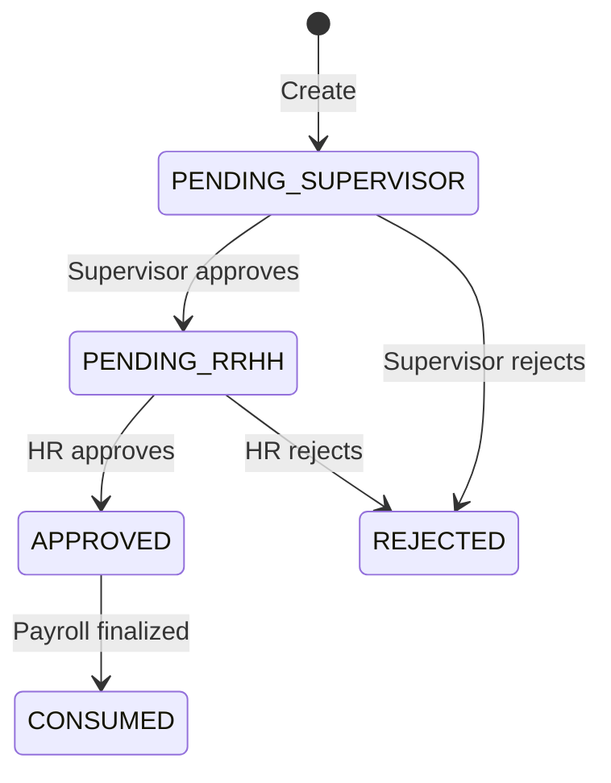

Bonuses represent additional compensation paid to employees beyond their base salary. The system supports multiple bonus types with different tax and social security implications.

## Overview

Bonus actions (`tipoAccion: 'bonificacion'`) enable HR to:
- Award performance-based bonuses
- Distribute profit-sharing payments
- Process special recognitions
- Handle expense reimbursements
- Track salary vs. non-salary compensation

## Bonus types

Each bonus must be classified by its nature, which affects tax treatment and social security calculations.

<Tabs>
  <Tab title="Ordinary salary">
    **Ordinary salary bonuses** (`ordinaria_salarial`) are regular, predictable payments that form part of the employee's base compensation.
    
    Characteristics:
    - Subject to income tax withholding
    - Included in social security base
    - Affects severance and vacation calculations
    - Reported as ordinary salary income
    
    Examples:
    - Regular monthly commissions
    - Fixed quarterly bonuses
    - Shift differentials
    
    ```typescript
    tipoBonificacion: TipoBonificacionLinea.ORDINARIA_SALARIAL
    ```
  </Tab>
  
  <Tab title="Extraordinary habitual">
    **Extraordinary habitual bonuses** (`extraordinaria_habitual`) are additional payments that occur regularly but are not part of base salary.
    
    Characteristics:
    - Subject to special tax treatment
    - Included in social security calculations
    - Typically annual or semi-annual
    - May have different withholding rates
    
    Examples:
    - Annual Christmas bonus (aguinaldo)
    - Year-end performance bonus
    - Profit-sharing (if regular)
    
    ```typescript
    tipoBonificacion: TipoBonificacionLinea.EXTRAORDINARIA_HABITUAL
    ```
  </Tab>
  
  <Tab title="Extraordinary occasional">
    **Extraordinary occasional bonuses** (`extraordinaria_ocasional`) are one-time or irregular payments.
    
    Characteristics:
    - Special tax rates may apply
    - Included in social security base
    - Non-recurring nature
    - Separate reporting requirements
    
    Examples:
    - One-time recognition award
    - Project completion bonus
    - Retention bonus
    - Special sales incentive
    
    ```typescript
    tipoBonificacion: TipoBonificacionLinea.EXTRAORDINARIA_OCASIONAL
    ```
  </Tab>
  
  <Tab title="Non-salary reimbursement">
    **Non-salary reimbursements** (`no_salarial_reembolso`) are payments that do not constitute salary.
    
    Characteristics:
    - Not subject to income tax (if documented)
    - Excluded from social security
    - No impact on severance calculations
    - Requires supporting documentation
    
    Examples:
    - Mileage reimbursement
    - Meal allowances (per diem)
    - Cell phone reimbursement
    - Travel expenses
    
    <Warning>
    Proper documentation is required to maintain non-salary classification. Without receipts, these may be reclassified as taxable income.
    </Warning>
    
    ```typescript
    tipoBonificacion: TipoBonificacionLinea.NO_SALARIAL_REEMBOLSO
    ```
  </Tab>
</Tabs>

## Creating bonuses

Bonuses are created through the `/personal-actions/bonificaciones` endpoint.

### Request structure

```typescript
interface UpsertBonusDto {
  idEmpresa: number;
  idEmpleado: number;
  observacion?: string;     // Optional notes (max 500 chars)
  lines: BonusLine[];       // One or more bonus lines
}

interface BonusLine {
  payrollId: number;                    // Target payroll calendar
  fechaEfecto: string;                  // Effective date (ISO 8601)
  movimientoId: number;                 // Payroll movement ID
  tipoBonificacion: BonusType;          // Bonus classification
  cantidad: number;                     // Units (typically 1 for bonuses)
  monto: number;                        // Bonus amount
  remuneracion: boolean;                // Counts as salary (typically true)
  formula?: string;                     // Optional calculation formula
}

type BonusType = 
  | 'ordinaria_salarial'
  | 'extraordinaria_habitual'
  | 'extraordinaria_ocasional'
  | 'no_salarial_reembolso';
```

### Example: Performance bonus

```typescript
POST /personal-actions/bonificaciones
Content-Type: application/json

{
  "idEmpresa": 1,
  "idEmpleado": 42,
  "observacion": "Q1 2026 performance bonus - exceeded sales targets by 25%",
  "lines": [
    {
      "payrollId": 100,
      "fechaEfecto": "2026-03-31",
      "movimientoId": 12,
      "tipoBonificacion": "extraordinaria_ocasional",
      "cantidad": 1,
      "monto": 5000.00,
      "remuneracion": true
    }
  ]
}
```

### Example: Multi-period commission

```typescript
POST /personal-actions/bonificaciones
Content-Type: application/json

{
  "idEmpresa": 1,
  "idEmpleado": 42,
  "observacion": "Monthly commission - January to March 2026",
  "lines": [
    {
      "payrollId": 98,
      "fechaEfecto": "2026-01-31",
      "movimientoId": 15,
      "tipoBonificacion": "ordinaria_salarial",
      "cantidad": 1,
      "monto": 1500.00,
      "remuneracion": true
    },
    {
      "payrollId": 99,
      "fechaEfecto": "2026-02-28",
      "movimientoId": 15,
      "tipoBonificacion": "ordinaria_salarial",
      "cantidad": 1,
      "monto": 1750.00,
      "remuneracion": true
    },
    {
      "payrollId": 100,
      "fechaEfecto": "2026-03-31",
      "movimientoId": 15,
      "tipoBonificacion": "ordinaria_salarial",
      "cantidad": 1,
      "monto": 2000.00,
      "remuneracion": true
    }
  ]
}
```

## Approval workflow

Bonuses follow the same multi-stage approval workflow as other personal actions.

<Steps>
  <Step title="Supervisor approval">
    Bonuses start in `PENDING_SUPERVISOR` state (2).
    
    **Required permission:** `hr-action-bonificaciones:approve`
    
    ```bash
    PATCH /personal-actions/bonificaciones/123/advance
    ```
    
    Supervisor approval moves the bonus to `PENDING_RRHH` (3).
  </Step>
  
  <Step title="HR approval">
    HR department reviews for policy compliance and budget approval.
    
    **Required permission:** `hr-action-bonificaciones:approve`
    
    ```bash
    PATCH /personal-actions/bonificaciones/123/advance
    ```
    
    HR approval moves the bonus to `APPROVED` (4) and triggers payroll recalculation.
  </Step>
  
  <Step title="Payroll processing">
    Approved bonuses are included in the next payroll calculation cycle.
    
    The system creates quotas and associates them with the specified payroll periods.
  </Step>
</Steps>

### State diagram



## Validation rules

The system enforces validation to ensure bonus data integrity.

### Amount validation

<AccordionGroup>
  <Accordion title="Quantity requirements">
    - `cantidad` must be ≥ 1
    - Typically set to 1 for bonus payments
    - Can be greater for unit-based bonuses (e.g., per-item commission)
    
    ```typescript
    @IsInt()
    @Type(() => Number)
    @Min(1)
    cantidad: number;
    ```
  </Accordion>
  
  <Accordion title="Amount requirements">
    - `monto` must be ≥ 0
    - Maximum: 9,999,999,999.99
    - Precision: 2 decimal places
    
    ```typescript
    @IsInt()
    @Type(() => Number)
    @Min(0)
    @Max(9999999999)
    monto: number;
    ```
  </Accordion>
  
  <Accordion title="Remuneracion flag">
    The `remuneracion` field indicates whether the bonus counts as salary:
    
    - `true`: Bonus is part of salary base (most common)
    - `false`: Bonus excluded from salary calculations
    
    <Info>
    Non-salary reimbursements (`no_salarial_reembolso`) should typically have `remuneracion: false`.
    </Info>
  </Accordion>
</AccordionGroup>

### Payroll validation

```typescript
// Eligible payroll states
EstadoCalendarioNomina.ABIERTA      // Open
EstadoCalendarioNomina.EN_PROCESO   // Processing
```

<Warning>
Bonuses cannot be added to payrolls in `APLICADA` (finalized) state.
</Warning>

## Payroll integration

Bonuses integrate with payroll through quotas and movements.

### Quota creation

Each bonus line creates an action quota:

```typescript
// From personal-actions.service.ts (bonus creation logic)
const quota = trx.create(ActionQuota, {
  idAccion: savedAction.id,
  idEmpresa: dto.idEmpresa,
  idEmpleado: dto.idEmpleado,
  idCalendarioNomina: line.payrollId,
  numeroCuota: i + 1,
  montoCuota: Number(line.monto),
  estado: EstadoCuota.PENDIENTE_APROBACION,
  fechaEfecto: new Date(line.fechaEfecto),
  motivoEstado: null,
});
```

### Movement configuration

Bonus movements (`nom_movimientos_nomina`) define how bonuses are calculated and reported:

```typescript
{
  id_movimiento_nomina: 12,
  nombre_movimiento_nomina: "Bonificación Extraordinaria",
  id_tipo_accion_personal_movimiento_nomina: 4,  // Bonus type
  es_monto_fijo_movimiento_nomina: 1,
  porcentaje_movimiento_nomina: 0,
  formula_ayuda_movimiento_nomina: "monto_linea"
}
```

### Tax calculations

Bonus type affects tax withholding:

- **Ordinary salary**: Standard income tax withholding applies
- **Extraordinary habitual**: May use special aguinaldo rates
- **Extraordinary occasional**: Often subject to flat-rate withholding
- **Non-salary reimbursement**: No tax withholding (if properly documented)

<Note>
Tax calculations are handled by the payroll calculation engine, which reads the `tipoBonificacion` field and applies the appropriate formulas.
</Note>

## Editing bonuses

Bonuses in draft or pending states can be edited:

```typescript
PATCH /personal-actions/bonificaciones/123
Content-Type: application/json

{
  "idEmpresa": 1,
  "idEmpleado": 42,
  "observacion": "Updated: Increased to $6000 based on final quarter results",
  "lines": [
    {
      "payrollId": 100,
      "fechaEfecto": "2026-03-31",
      "movimientoId": 12,
      "tipoBonificacion": "extraordinaria_ocasional",
      "cantidad": 1,
      "monto": 6000.00,  // Increased from 5000
      "remuneracion": true
    }
  ]
}
```

### Edit restrictions

<Tabs>
  <Tab title="Allowed">
    You can edit bonuses in these states:
    - `DRAFT` (1)
    - `PENDING_SUPERVISOR` (2)
    - `PENDING_RRHH` (3)
    
    **Editable fields:**
    - `observacion`
    - `monto`
    - `cantidad`
    - `tipoBonificacion`
    - `fechaEfecto`
    - Line additions/removals
  </Tab>
  
  <Tab title="Not allowed">
    You **cannot** edit bonuses in these states:
    - `APPROVED` (4)
    - `CONSUMED` (5)
    - `CANCELLED` (6)
    - `INVALIDATED` (7)
    - `REJECTED` (9)
    
    **Cannot change:**
    - `idEmpresa`
    - `idEmpleado`
  </Tab>
</Tabs>

## Invalidating bonuses

Invalidate bonuses that should not be paid:

```bash
PATCH /personal-actions/bonificaciones/123/invalidate
Content-Type: application/json

{
  "motivo": "Performance targets were not met after all - quarterly results revised downward"
}
```

**Required permission:** `hr-action-bonificaciones:cancel`

<Info>
Invalidation cancels all unpaid quotas. If some quotas have already been paid in finalized payroll periods, those cannot be reversed.
</Info>

## Retrieving bonus details

Get complete bonus information:

```bash
GET /personal-actions/bonificaciones/123
```

### Response structure

```json
{
  "id": 123,
  "idEmpresa": 1,
  "idEmpleado": 42,
  "tipoAccion": "bonificacion",
  "groupId": "BON-1709567890-a8x3m2",
  "estado": 4,
  "descripcion": "Q1 2026 performance bonus",
  "fechaEfecto": "2026-03-31",
  "monto": 5000.00,
  "moneda": "CRC",
  "aprobadoPor": 5,
  "fechaAprobacion": "2026-03-30T14:20:00Z",
  "lines": [
    {
      "idLinea": 789,
      "idAccion": 123,
      "payrollId": 100,
      "payrollLabel": "Quincena 2 - Marzo 2026",
      "payrollEstado": 1,
      "movimientoId": 12,
      "movimientoLabel": "Bonificación Extraordinaria",
      "movimientoInactivo": false,
      "tipoBonificacion": "extraordinaria_ocasional",
      "cantidad": 1,
      "monto": 5000.00,
      "remuneracion": true,
      "formula": "monto_linea",
      "orden": 1,
      "fechaEfecto": "2026-03-31"
    }
  ]
}
```

## Audit trail

Track all changes to bonuses:

```bash
GET /personal-actions/bonificaciones/123/audit-trail?limit=50
```

The audit trail captures:
- Amount changes
- Type reclassifications
- Approval transitions
- Invalidation reasons

## Database schema

Bonus-specific table structure:

```sql
CREATE TABLE acc_bonificaciones_lineas (
  id_linea_bonificacion INT PRIMARY KEY,
  id_accion INT NOT NULL,
  id_cuota INT,
  id_empresa INT NOT NULL,
  id_empleado INT NOT NULL,
  id_calendario_nomina INT NOT NULL,
  id_movimiento_nomina INT NOT NULL,
  tipo_bonificacion_linea ENUM(
    'ordinaria_salarial',
    'extraordinaria_habitual',
    'extraordinaria_ocasional',
    'no_salarial_reembolso'
  ) NOT NULL,
  cantidad_linea INT NOT NULL,
  monto_linea DECIMAL(12,2) NOT NULL,
  remuneracion_linea TINYINT(1) DEFAULT 1,
  formula_linea TEXT,
  orden_linea INT,
  fecha_efecto_linea DATE,
  fecha_creacion_linea DATETIME,
  fecha_modificacion_linea DATETIME,
  FOREIGN KEY (id_accion) REFERENCES acc_acciones_personal(id_accion),
  INDEX idx_bon_linea_accion (id_accion),
  INDEX idx_bon_linea_empleado (id_empleado),
  INDEX idx_bon_linea_calendario (id_calendario_nomina)
);
```

## Best practices

<AccordionGroup>
  <Accordion title="Choose the correct bonus type">
    Bonus classification has significant tax and legal implications. Consult with accounting or legal before classifying bonuses.
    
    **Decision tree:**
    
    1. Is it a reimbursement for actual expenses?
       - Yes → `no_salarial_reembolso`
       - No → Continue
    
    2. Is it a regular, predictable payment?
       - Yes → `ordinaria_salarial`
       - No → Continue
    
    3. Does it occur annually or regularly?
       - Yes → `extraordinaria_habitual`
       - No → `extraordinaria_ocasional`
  </Accordion>
  
  <Accordion title="Document reimbursements properly">
    Non-salary reimbursements require supporting documentation:
    
    ```typescript
    {
      "observacion": "Travel reimbursement - Trip to San José 3/15-3/17. " +
                     "Receipts on file: hotel $450, meals $120, mileage 250km. " +
                     "Ref: EXPENSE-2026-0315",
      "tipoBonificacion": "no_salarial_reembolso",
      "remuneracion": false
    }
    ```
    
    Include reference numbers for expense reports or receipt documentation.
  </Accordion>
  
  <Accordion title="Use formulas for percentage-based bonuses">
    When bonuses are calculated as a percentage of salary, use formulas:
    
    ```typescript
    {
      "formula": "salario_base * 0.10",  // 10% of base salary
      "monto": 0  // Will be calculated by payroll engine
    }
    ```
    
    This ensures the bonus stays correct if the employee's salary changes.
  </Accordion>
  
  <Accordion title="Coordinate with payroll schedule">
    Create bonuses with `fechaEfecto` that aligns with payroll cut-off dates:
    
    ```typescript
    // Good: Aligns with payroll end date
    {
      "payrollId": 100,
      "fechaEfecto": "2026-03-31"  // Last day of payroll period
    }
    
    // Bad: Mid-period date may cause confusion
    {
      "payrollId": 100,
      "fechaEfecto": "2026-03-15"  // Middle of period
    }
    ```
  </Accordion>
</AccordionGroup>

## Common scenarios

### Annual aguinaldo (Christmas bonus)

```typescript
POST /personal-actions/bonificaciones
{
  "idEmpresa": 1,
  "idEmpleado": 42,
  "observacion": "Aguinaldo 2026 - 8.33% of annual salary",
  "lines": [{
    "payrollId": 124,
    "fechaEfecto": "2026-12-20",
    "movimientoId": 20,
    "tipoBonificacion": "extraordinaria_habitual",
    "cantidad": 1,
    "monto": 0,
    "remuneracion": true,
    "formula": "(salario_base * 12) * 0.0833"
  }]
}
```

### Sales commission

```typescript
POST /personal-actions/bonificaciones
{
  "idEmpresa": 1,
  "idEmpleado": 42,
  "observacion": "March 2026 sales commission - $150,000 in sales at 2% rate",
  "lines": [{
    "payrollId": 100,
    "fechaEfecto": "2026-03-31",
    "movimientoId": 15,
    "tipoBonificacion": "ordinaria_salarial",
    "cantidad": 1,
    "monto": 3000.00,
    "remuneracion": true
  }]
}
```

### Mileage reimbursement

```typescript
POST /personal-actions/bonificaciones
{
  "idEmpresa": 1,
  "idEmpleado": 42,
  "observacion": "Mileage reimbursement March 2026 - 450 km at 500 per km",
  "lines": [{
    "payrollId": 100,
    "fechaEfecto": "2026-03-31",
    "movimientoId": 25,
    "tipoBonificacion": "no_salarial_reembolso",
    "cantidad": 450,
    "monto": 225000,
    "remuneracion": false,
    "formula": "cantidad * 500"
  }]
}
```

## Code reference

Key implementation files:

- **Service**: `/src/modules/personal-actions/personal-actions.service.ts` (createBonus)
- **Entity**: `/src/modules/personal-actions/entities/bonus-line.entity.ts:10`
- **DTO**: `/src/modules/personal-actions/dto/upsert-bonus.dto.ts`
- **Controller**: `/src/modules/personal-actions/personal-actions.controller.ts:410`

## Related topics

<CardGroup cols={2}>
  <Card title="Overview" icon="book" href="/personal-actions/overview">
    Personal actions system overview
  </Card>
  <Card title="Absences" icon="calendar-xmark" href="/personal-actions/absences">
    Manage employee absences
  </Card>
  <Card title="Overtime" icon="clock" href="/personal-actions/overtime">
    Track overtime hours and pay
  </Card>
  <Card title="Payroll integration" icon="money-bill-wave" href="/payroll/overview">
    How bonuses affect payroll calculations
  </Card>
</CardGroup>